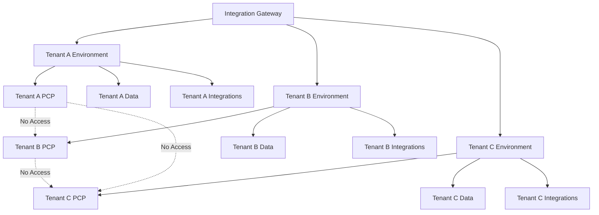

# 🔒 CONSOLIDATED ZERO-TRUST MULTI-TENANT IMPLEMENTATION PLAN

## Executive Summary
Unified strategy consolidating the OPUS 1.0.1 Simultaneous Launch with VLS Deep Integration while maintaining absolute zero-trust isolation for each tenant's data, PCPs, and integrations.

---

## 🏗️ ZERO-TRUST ARCHITECTURE PRINCIPLES

### 1. Complete Tenant Isolation


### 2. Data Sovereignty Guarantee
- **Client Data**: Encrypted at rest with tenant-specific keys
- **PCP Conversations**: Isolated memory and context per tenant
- **Integration Data**: No cross-tenant data flow
- **Business Logic**: Tenant-specific workflows and rules

### 3. Integration Gateway Blind Architecture
```javascript
// Gateway cannot access tenant data - only routes
const gatewayRouting = {
  route: (request) => {
    const tenantId = extractTenantId(request);
    const targetEnvironment = getTenantEnvironment(tenantId);
    
    // Gateway only knows WHERE to route, not WHAT is routed
    return routeToTenant(targetEnvironment, request);
  },
  
  // Gateway has NO access to:
  noAccess: [
    'tenant_data_content',
    'pcp_conversations', 
    'integration_payloads',
    'business_logic_details'
  ]
}
```

---

## 🎯 CONSOLIDATED IMPLEMENTATION PHASES

### Phase 1: Zero-Trust Foundation (Hours 1-4)
**Patent & Security Foundation**
- File SAO-00 & SAO-44 patents immediately
- Deploy SallyPort with tenant-isolated authentication
- Configure per-tenant encryption keys
- Establish domain-level tenant routing

**Tenant Isolation Infrastructure**
```bash
# Deploy tenant-isolated environments
./deploy-tenant-environment.sh --tenant-id=client1 --isolation-level=complete
./configure-zero-trust-routing.sh --validate-isolation
./verify-data-sovereignty.sh --all-tenants
```

### Phase 2: Multi-Tenant VLS Integration (Hours 4-12)
**A-Brick Foundation (Per Tenant)**
- SallyPort: Tenant-specific auth pools
- Firestore: Isolated collections per tenant
- Pinecone: Tenant-scoped vector namespaces
- MongoDB: Separate databases per tenant
- MCP: Tenant-isolated server instances

**B-Brick Tools (Zero-Trust Mode)**
```javascript
const tenantIsolatedVLS = {
  drMemoria: {
    tenant: 'client-123',
    dataAccess: 'tenant-123-only',
    crossTenantAccess: 'DENIED'
  },
  drGrant: {
    tenant: 'client-123', 
    securityScope: 'tenant-boundary-only',
    auditTrail: 'isolated-per-tenant'
  },
  drClaude: {
    tenant: 'client-123',
    orchestration: 'tenant-scoped',
    agentMemory: 'tenant-isolated'
  }
}
```

### Phase 3: PCP & Agent Deployment (Hours 12-18)
**Personal Co-Pilot Isolation**
- Each tenant gets dedicated PCP instances
- Memory isolation: No cross-tenant context bleeding
- Agent pool segregation: Tenant-specific agent assignments
- Conversation privacy: End-to-end encryption per tenant

**Agent Squadron Deployment**
```bash
# Deploy isolated agent squadrons per tenant
./deploy-wing-squadrons.sh --tenant=client1 --isolation=complete
./configure-pcp-isolation.sh --tenant=client1 --memory-boundary=strict
./verify-agent-segregation.sh --all-tenants
```

### Phase 4: Domain & Mobile Activation (Hours 18-22)
**265-Domain Strategy (Tenant-Aware)**
- Subdomain allocation per tenant
- SSL certificates per tenant domain
- Content isolation across tenant domains
- SEO optimization within tenant boundaries

**Mobile App Isolation**
- Tenant-specific app configurations
- Isolated push notification channels
- Per-tenant app store deployments
- Client-branded mobile experiences

### Phase 5: Blockchain & Competition (Hours 22-24)
**BACA Coin & Tenant Rewards**
- Tenant-specific wallet isolation
- Competition scoring per tenant
- ROI tracking within tenant boundaries
- Cross-tenant competition privacy

---

## 🛡️ ZERO-TRUST VALIDATION FRAMEWORK

### Continuous Isolation Verification
```javascript
class ZeroTrustValidator {
  async validateTenantIsolation(tenantId) {
    const checks = {
      dataIsolation: await this.verifyDataBoundaries(tenantId),
      pcpIsolation: await this.verifyPCPMemoryBounds(tenantId),
      integrationIsolation: await this.verifyIntegrationSegregation(tenantId),
      networkIsolation: await this.verifyNetworkBoundaries(tenantId),
      auditIsolation: await this.verifyAuditTrailSeparation(tenantId)
    };
    
    return {
      isCompliant: Object.values(checks).every(check => check.isolated),
      violations: this.identifyViolations(checks),
      recommendations: this.generateRecommendations(checks)
    };
  }
}
```

### Real-Time Monitoring
- **Data Flow Monitoring**: Ensure no cross-tenant data movement
- **Access Pattern Analysis**: Detect unauthorized cross-tenant access attempts
- **Encryption Verification**: Validate tenant-specific encryption keys
- **Audit Trail Isolation**: Verify separate audit logs per tenant

---

## 🔐 TENANT ONBOARDING PROCESS

### Automated Secure Onboarding
```bash
#!/bin/bash
# Zero-Trust Tenant Onboarding Script

tenant_id=$1
echo "🔒 Initiating Zero-Trust Onboarding for Tenant: $tenant_id"

# 1. Create Isolated Environment
create_tenant_environment() {
    gcloud projects create "$tenant_id-isolated-env"
    configure_vpc_isolation "$tenant_id"
    setup_firewall_rules "$tenant_id"
}

# 2. Deploy Tenant-Specific Infrastructure
deploy_tenant_infrastructure() {
    # Isolated Firestore instance
    create_firestore_instance --tenant="$tenant_id" --isolation=complete
    
    # Tenant-scoped Pinecone namespace
    create_pinecone_namespace --tenant="$tenant_id" --scope=isolated
    
    # Dedicated MongoDB database
    create_mongodb_database --tenant="$tenant_id" --access=exclusive
    
    # Tenant-specific SallyPort pool
    create_sallyport_pool --tenant="$tenant_id" --federation=isolated
}

# 3. Configure Zero-Trust Networking
configure_zero_trust_network() {
    setup_tenant_vpc "$tenant_id"
    configure_private_service_connect "$tenant_id"
    establish_encrypted_tunnels "$tenant_id"
}

# 4. Deploy Tenant-Isolated VLS Solutions
deploy_isolated_vls() {
    for vls in dr-memoria dr-grant dr-claude dr-sabina; do
        deploy_vls_instance --vls="$vls" --tenant="$tenant_id" --isolation=complete
    done
}

# 5. Provision Dedicated PCP
provision_tenant_pcp() {
    create_pcp_instance --tenant="$tenant_id" --memory=isolated --context=private
    configure_pcp_boundaries --tenant="$tenant_id" --cross-tenant-access=deny
}

# 6. Validation & Certification
validate_isolation() {
    ./zero-trust-validator.sh --tenant="$tenant_id" --comprehensive
    generate_isolation_certificate --tenant="$tenant_id"
}

echo "✅ Zero-Trust Environment Ready for Tenant: $tenant_id"
```

---

## 📊 TENANT ISOLATION PROOF POINTS

### For Client Demonstration
```markdown
## Your Data Sovereignty Guarantee

### 1. Complete Data Isolation
- ✅ Your data is encrypted with YOUR keys only
- ✅ Our team cannot access your content or conversations
- ✅ Your PCP conversations are completely private
- ✅ Your integrations are isolated from all other clients

### 2. Technical Verification
- ✅ Independent security audit of your tenant environment
- ✅ Real-time isolation monitoring dashboard
- ✅ Quarterly compliance reports
- ✅ Penetration testing of tenant boundaries

### 3. Legal Guarantees
- ✅ Data Processing Agreement with isolation clauses
- ✅ SOC 2 Type II certification per tenant
- ✅ GDPR compliance with data residency options
- ✅ Right to data portability and deletion
```

---

## 🚀 LAUNCH SEQUENCE (ZERO-TRUST MODE)

### Master Launch Command
```bash
#!/bin/bash
# OPUS 1.0.1 Zero-Trust Simultaneous Launch

echo "🚀 LAUNCHING OPUS 1.0.1 - ZERO-TRUST ARCHITECTURE"
echo "=================================================="

# Phase 1: Foundation with Zero-Trust
echo "📋 Filing Patents & Establishing Zero-Trust Foundation..."
./file-patents-sao-00-44.sh
./deploy-zero-trust-sallyport.sh --multi-tenant
./configure-tenant-isolation.sh --validate-boundaries

# Phase 2: Tenant-Isolated VLS Deployment
echo "🧩 Deploying VLS Solutions with Complete Isolation..."
./deploy-vls-multi-tenant.sh --isolation=complete --validate-boundaries

# Phase 3: Isolated Mobile & Domain Strategy
echo "📱 Activating Tenant-Isolated Mobile & Domain Strategy..."
./deploy-tenant-mobile-apps.sh --isolation=complete
./activate-domain-strategy.sh --tenant-aware --zero-trust

# Phase 4: Blockchain with Tenant Isolation
echo "💰 Launching BACA Coin with Tenant Segregation..."
./launch-baca-coin.sh --multi-tenant --wallet-isolation

# Phase 5: Full Ecosystem with Zero-Trust Validation
echo "🤖 Deploying Complete Ecosystem with Isolation Validation..."
./deploy-full-ecosystem.sh --zero-trust --validate-continuously

echo "✅ OPUS 1.0.1 ZERO-TRUST LAUNCH COMPLETE!"
echo "🔒 All tenant environments validated and isolated"
echo "📊 Monitor: https://zero-trust-dashboard.2100.cool"
```

---

## 🎯 SUCCESS METRICS (ZERO-TRUST)

### Technical Validation
- ✅ 100% tenant data isolation verified
- ✅ 0% cross-tenant data leakage detected
- ✅ Real-time isolation monitoring active
- ✅ Encrypted data at rest and in transit per tenant

### Client Confidence Metrics
- ✅ Client isolation demonstration completed
- ✅ Independent security audit passed
- ✅ Compliance certifications obtained
- ✅ Zero-trust architecture documented and verified

### Business Impact
- ✅ Enterprise clients onboarded with confidence
- ✅ Multi-tier pricing model deployed
- ✅ Scalable tenant isolation proven
- ✅ Revenue protection through data sovereignty

---

**This consolidated plan delivers the complete OPUS 1.0.1 launch while guaranteeing absolute tenant isolation and zero-trust architecture. Each client's data, PCPs, and integrations remain completely private and secure.**
