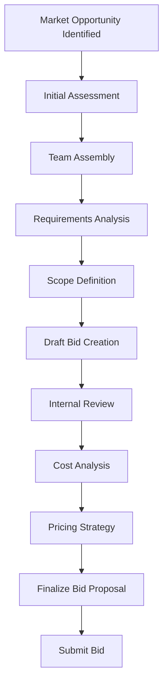
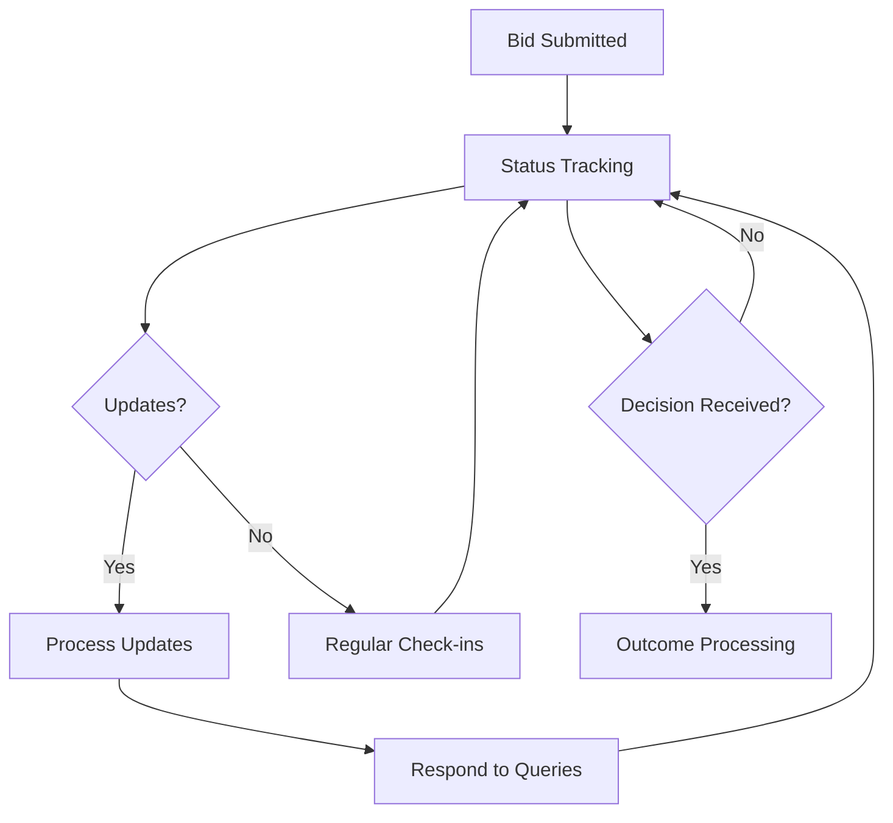
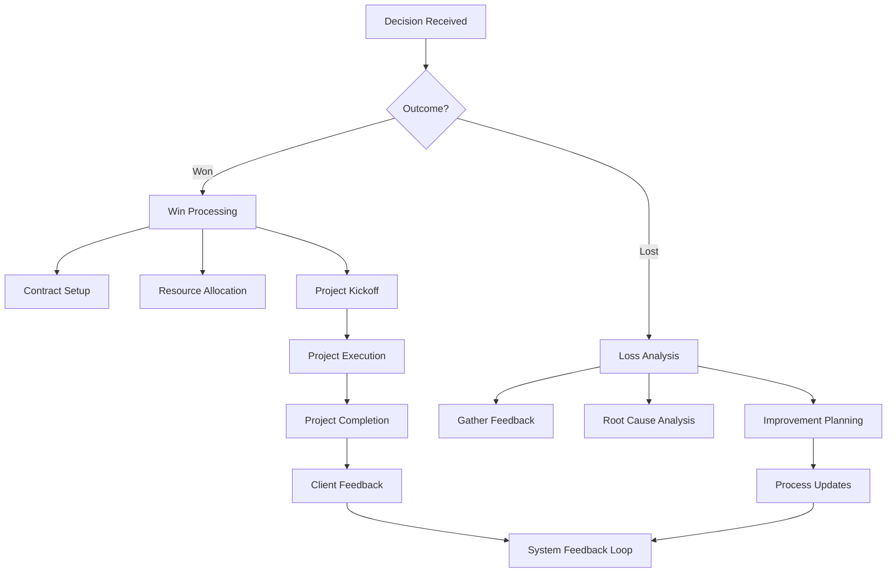
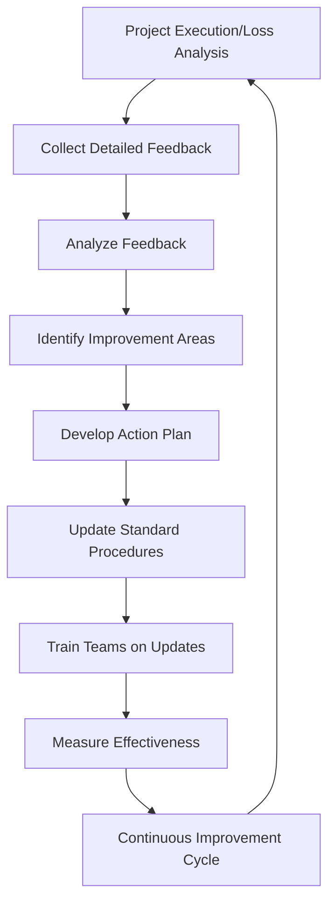

# AIXTIV Bid Suite: Complete Workflow Implementation

This document outlines the comprehensive end-to-end workflows for the Bid Suite, covering the entire journey from initial bid ideation to post-project feedback. Each workflow incorporates Standard Operating Procedures (S2DO) that standardize processes across all bid activities.

## 1. Bid Lifecycle Management Architecture

The Bid Suite implements a complete lifecycle management system with these key components:


### Core Components

- **BidLifecycleManager**: Orchestrates the entire bid journey
- **StandardOperatingProcedureManager**: Enforces standardized processes
- **BidFeedbackSystem**: Captures and analyzes feedback at all stages
- **BidMetricsTracker**: Measures performance metrics throughout the lifecycle

## 2. End-to-End Workflow

### Phase 1: Bid Ideation & Creation



#### S2DO: Bid Creation Process

1. **Opportunity Qualification**
   - Assess alignment with company capabilities
   - Determine win probability using predictive analytics
   - Document decision rationale

2. **Resource Assessment**
   - Evaluate required expertise and resources
   - Conduct capacity analysis
   - Reserve necessary resources

3. **Requirements Documentation**
   - Capture detailed client requirements
   - Identify and document constraints
   - Map requirements to capabilities

4. **Pricing Strategy Development**
   - Analyze competitive landscape
   - Develop cost model
   - Determine pricing approach
   - Secure internal approvals

### Phase 2: Bid Monitoring & Management



#### S2DO: Bid Monitoring Process

1. **Active Monitoring Setup**
   - Configure alert thresholds
   - Assign monitoring responsibilities
   - Schedule regular status checks

2. **Query Management**
   - Document all client queries
   - Route queries to appropriate experts
   - Track response times and quality
   - Ensure all queries receive timely follow-up

3. **Status Reporting**
   - Generate regular status reports
   - Communicate updates to stakeholders
   - Document any bid status changes

### Phase 3: Win/Loss Processing



#### S2DO: Win Processing Workflow

1. **Win Confirmation**
   - Verify win details and terms
   - Update all systems with win status
   - Notify all relevant stakeholders

2. **Contract Preparation**
   - Draft formal contract
   - Conduct legal review
   - Finalize terms and conditions
   - Secure signatures

3. **Resource Allocation**
   - Confirm resource availability
   - Finalize resource assignments
   - Schedule kickoff activities

4. **Win Analysis**
   - Document winning factors
   - Capture successful strategies
   - Update bid templates based on insights

#### S2DO: Loss Processing Workflow

1. **Loss Documentation**
   - Record loss details
   - Update systems with loss status
   - Notify stakeholders

2. **Client Feedback Collection**
   - Request feedback from client
   - Document feedback received
   - Analyze decision factors

3. **Competitive Analysis**
   - Identify winning competitor
   - Analyze competitive strengths/weaknesses
   - Document price differential (if known)

4. **Team Debrief**
   - Conduct loss analysis meeting
   - Document lessons learned
   - Develop improvement recommendations

### Phase 4: Post-Bid Feedback Loop



#### S2DO: Feedback Integration Process

1. **Feedback Collection**
   - Gather internal team feedback
   - Collect client/prospect feedback
   - Document all feedback with metadata

2. **Analysis & Categorization**
   - Analyze feedback themes
   - Categorize improvement opportunities
   - Prioritize action items

3. **Process Enhancement**
   - Update bid templates
   - Refine pricing strategies
   - Enhance response approaches
   - Update S2DO procedures

4. **Knowledge Sharing**
   - Distribute lessons learned
   - Update training materials
   - Conduct knowledge transfer sessions

## 3. Implementing Standardized Workflows

### 3.1 Standard Operating Procedure Framework

All bid activities follow a standardized approach with these components:

1. **Procedure Definition**
   - Clear step-by-step instructions
   - Role assignments
   - Time estimates
   - Quality standards

2. **Required Artifacts**
   - Document templates
   - Checklists
   - Review criteria
   - Approval workflows

3. **Governance Model**
   - Approval authorities
   - Decision criteria
   - Exception handling
   - Compliance requirements

### 3.2 System Implementation

```typescript
// Example usage of the BidLifecycleManager

// Initialize the manager
const bidManager = new BidLifecycleManager(firestore);

// Submit a new bid
const bidResult = await bidManager.submitBid({
  title: "Healthcare Analytics Platform",
  description: "Development of advanced analytics solution for hospital network",
  amount: 250000,
  currency: "USD",
  expiresAt: Timestamp.fromDate(new Date("2025-06-30")),
  ownerId: "user123",
  ownerName: "Alex Johnson",
  category: BidCategory.HEALTHCARE,
  tags: ["analytics", "healthcare", "data science"],
  visibility: BidVisibility.PUBLIC
}, "user123", "Alex Johnson");

// Set up monitoring
const unsubscribe = bidManager.monitorBids({
  statuses: [BidStatus.OPEN, BidStatus.UNDER_REVIEW],
  ownerId: "user123",
  expiringWithinDays: 14
}, (bids) => {
  console.log(`Monitoring ${bids.length} active bids`);
  // Process bids...
});

// Record a win
await bidManager.markBidAsWon(
  "bid123", 
  "user123", 
  "Alex Johnson", 
  {
    finalAmount: 245000,
    winningFactors: ["technical expertise", "competitive pricing"],
    decisionMaker: "Sarah Williams",
    contractLength: "24 months"
  }
);

// Record a loss
await bidManager.markBidAsLost(
  "bid456", 
  "user123", 
  "Alex Johnson", 
  {
    winner: "Competitor Inc.",
    lossFactors: ["price point too high", "timeline constraints"],
    priceDifferential: "15% higher"
  }
);

// Add feedback
await bidManager.addBidFeedback({
  bidId: "bid123",
  authorId: "client456",
  authorName: "Client Organization",
  content: "Proposal was comprehensive and well-structured. Team demonstrated excellent understanding of our requirements.",
  rating: 4.5,
  categoryScores: {
    technicalUnderstanding: 5,
    communication: 4,
    pricing: 4,
    innovation: 4.5
  },
  visibility: BidActivityVisibility.INTERNAL
});

// Get SOP for bid creation
const sop = await bidManager.getSOP(BidCategory.HEALTHCARE, "bid_creation");
```

## 4. Metrics & Performance Tracking

The system automatically tracks key performance indicators throughout the bid lifecycle:

### 4.1 Real-time Metrics Dashboard

- **Win Rate**: Overall and by category
- **Response Times**: Average time to respond to client queries
- **Feedback Scores**: Average client satisfaction ratings
- **Efficiency Metrics**: Time spent in each bid phase
- **Pipeline Value**: Total value of active bids

### 4.2 Trend Analysis

- **Month-over-month Win Rate Changes**
- **Category Performance Comparison**
- **Pricing Strategy Effectiveness**
- **Team Performance Metrics**

### 4.3 Automated Reports

- **Weekly Bid Status Summary**
- **Monthly Performance Review**
- **Quarterly Strategy Alignment**
- **Annual Trend Analysis**

## 5. eProcurement Integration

The BidLifecycleManager integrates with external eProcurement systems to:

1. **Synchronize Bid Status**
   - Automatically update local database when external status changes
   - Push updates from internal system to connected platforms

2. **Monitor Competitor Activity**
   - Track bid status across platforms
   - Analyze competitor patterns
   - Generate competitive intelligence reports

3. **Automate Document Exchange**
   - Synchronize documents between systems
   - Maintain version control
   - Ensure consistent content across platforms

4. **Unify Analytics**
   - Consolidate metrics across all platforms
   - Generate unified reports
   - Identify platform-specific performance variations

## 6. Implementation Checklist

- [ ] Configure Firestore collections and security rules
- [ ] Set up BidLifecycleManager and supporting services
- [ ] Create standard operating procedures for all bid activities
- [ ] Configure eProcurement system integrations
- [ ] Implement monitoring and alerting
- [ ] Set up metrics dashboards
- [ ] Train team members on new workflows
- [ ] Create documentation and reference guides
- [ ] Establish continuous improvement process

## 7. Advanced Features

### 7.1 Predictive Win Probability

The system calculates win probability based on:

- Historical performance data
- Current bid characteristics
- Client relationship factors
- Competitive landscape analysis
- Market conditions

### 7.2 Automated Recommendation Engine

The system provides recommendations for:

- Optimal pricing strategies
- Team composition
- Response approaches
- Competitive positioning
- Risk mitigation strategies

### 7.3 AI-Powered Bid Analysis

Machine learning models analyze:

- Bid content quality
- Client-specific preferences
- Historical winning patterns
- Language effectiveness
- Competitive differentiation

## 8. Conclusion

This comprehensive workflow implementation ensures that every bid follows a standardized, optimized process from ideation to completion. By incorporating feedback loops, continuous improvement mechanisms, and data-driven decision making, the AIXTIV Bid Suite provides a complete solution for maximizing bid success rates and operational efficiency.
