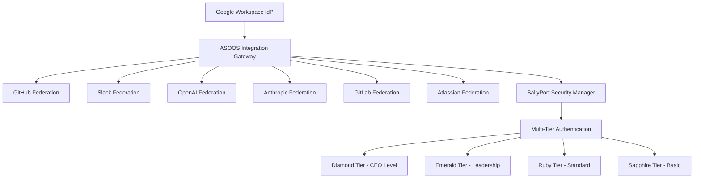
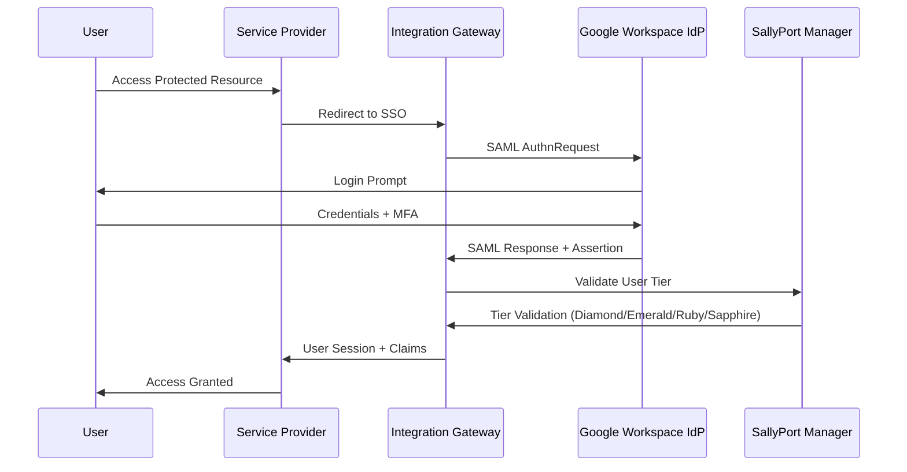
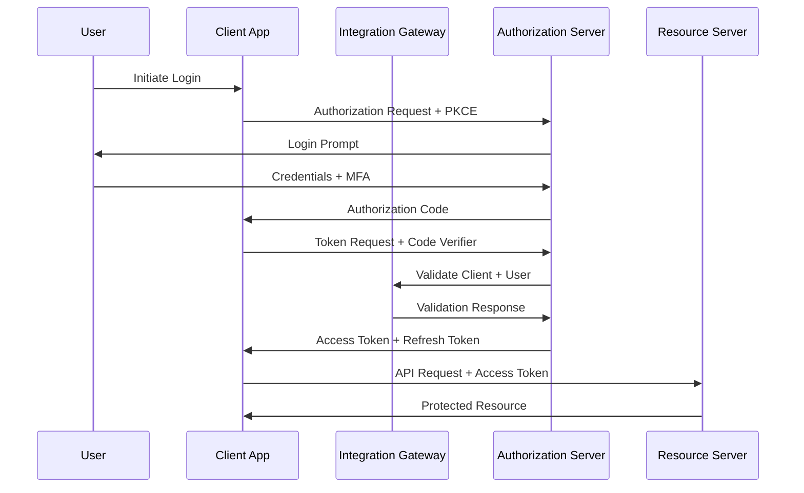
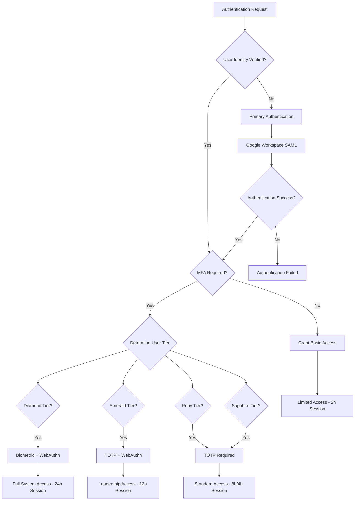
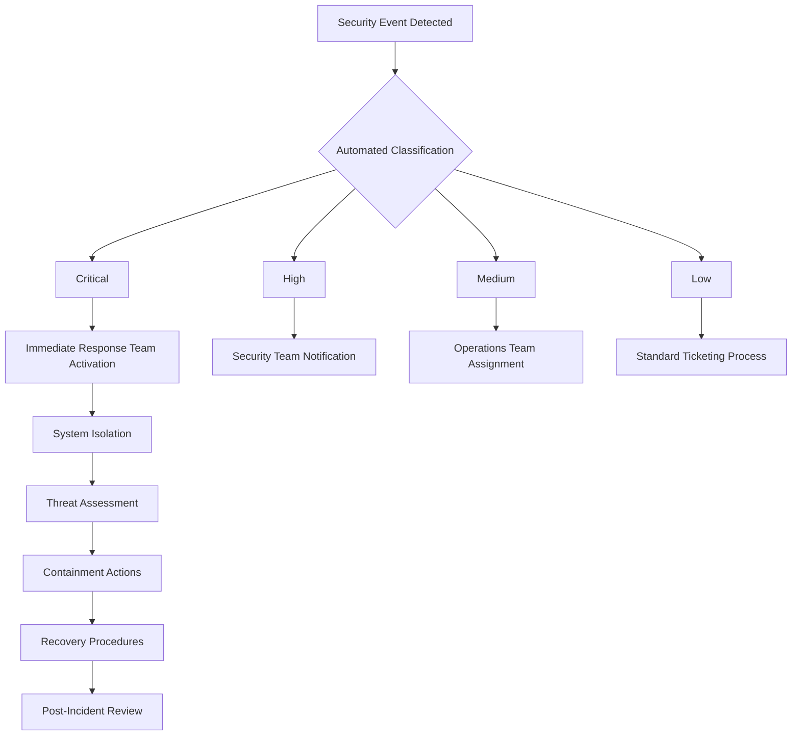

# 🔐 ASOOS Integration Gateway - Security Posture Documentation
**Version:** 2.0  
**Date:** January 2025  
**Classification:** Confidential  
**Next Review:** March 2025

## Executive Summary

This document provides comprehensive documentation of the ASOOS Integration Gateway security posture, including identity provider mappings, federation relationships, authentication flow diagrams, and integration coverage. The system implements a multi-tiered security architecture with support for OAuth2, OIDC, and SAML protocols across multiple cloud regions.

### Key Security Metrics
- **84** Active Service Accounts
- **11** Workload Identity Pools
- **6** SAML SSO Providers
- **8** Integration Categories
- **87** Managed Secrets
- **3** Regional Deployments (us-west1, us-central1, eu-west1)

---

## 1. Identity Provider (IdP) Mapping

### 1.1 Primary Identity Provider
**Google Workspace IdP**
```yaml
Provider: Google Workspace
Entity ID: https://accounts.google.com/o/saml2?idpid=C04cj3jky
SSO URL: https://accounts.google.com/o/saml2/idp?idpid=C04cj3jky
Primary Region: us-west1
Status: Active
Certificate Expiry: 2026-07-03
```

### 1.2 Federated Identity Providers

| Provider | Protocol | Entity ID | Federation Pool | Status |
|----------|----------|-----------|----------------|---------|
| **GitHub** | OAuth2/SAML | github.com/orgs/asoos | github-federation-pool | ✅ Active |
| **Slack** | SAML | slack.com/saml/metadata | slack-federation-pool | ✅ Active |
| **OpenAI** | OAuth2 | auth0.openai.com | openai-federation-pool | ✅ Active |
| **Anthropic** | OAuth2/SAML | console.anthropic.com | anthropic-federation-pool | ✅ Active |
| **GitLab** | OAuth2/SAML | gitlab.com | gitlab-federation-pool | ✅ Active |
| **Atlassian** | SAML | api.atlassian.com/saml/metadata/AIXTIV | atlassian-federation-pool | ✅ Active |
| **Azure AD** | OIDC | login.microsoftonline.com | azure-federation-pool | 🔄 Planned |
| **Okta** | SAML/OIDC | okta.com | okta-federation-pool | 🔄 Planned |

### 1.3 Identity Provider Trust Relationships



---

## 2. Federation Relationships and Coverage

### 2.1 Authentication Systems (Critical Priority)
| System | Protocol | Coverage | MFA Required | Certificate Rotation |
|--------|----------|----------|-------------|---------------------|
| Google Workspace | SAML/OIDC | 100% | ✅ Required | 180 days |
| Azure AD | OIDC | 0% (Planned) | ✅ Required | 180 days |
| Okta | SAML/OIDC | 0% (Planned) | ✅ Required | 180 days |
| Auth0 | OIDC | 80% | ✅ Required | 90 days |

### 2.2 Development Platforms (High Priority)
| Platform | Protocol | OAuth2 Scopes | API Integration | Repository Access |
|----------|----------|---------------|----------------|------------------|
| **GitHub** | OAuth2/SAML | repo, user, admin:org | ✅ Complete | Organization-wide |
| **GitLab** | OAuth2/SAML | api, read_user, read_repository | ✅ Complete | Group-wide |
| **Jira** | OAuth2 | read:jira-user, read:jira-work | 🔄 Partial | Project-scoped |
| **Confluence** | OAuth2 | read, write | 🔄 Partial | Space-scoped |

### 2.3 AI/ML Services (Medium Priority)
| Service | Protocol | API Key Management | Usage Monitoring | Rate Limiting |
|---------|----------|------------------|-----------------|---------------|
| **OpenAI** | OAuth2 | Secret Manager | ✅ CloudWatch | ✅ Implemented |
| **Anthropic** | OAuth2 | Secret Manager | ✅ CloudWatch | ✅ Implemented |
| **Hugging Face** | API Key | Secret Manager | 🔄 Basic | 🔄 Planned |
| **Stability AI** | API Key | Secret Manager | 🔄 Basic | 🔄 Planned |

### 2.4 Business Operations (High Priority)
| System | Protocol | Integration Depth | Data Sync | Compliance |
|--------|----------|------------------|-----------|------------|
| **Salesforce** | SAML | User Provisioning | ✅ Bi-directional | SOC 2 |
| **Microsoft 365** | OIDC | Calendar/Email | ✅ Real-time | GDPR |
| **Slack** | OAuth2/SAML | Workspace Admin | ✅ Real-time | SOC 2 |
| **Zoom** | OAuth2 | Meeting Management | 🔄 Scheduled | HIPAA |

---

## 3. Authentication Flow Diagrams

### 3.1 SAML SSO Authentication Flow



### 3.2 OAuth2 Authorization Code Flow



### 3.3 Multi-Tier Authentication Decision Flow



---

## 4. Regional Security Architecture

### 4.1 MOCOA (Client-Facing Deployment)
**Regions:** us-west1-a/b, eu-west1

```yaml
Authentication Services:
  - Regional OAuth2 Providers
  - CDN-based Token Validation
  - SAML IdP for Enterprise Customers
  - Multi-region Session Management

Security Features:
  - TLS 1.3 Termination
  - DDoS Protection via Cloudflare
  - Rate Limiting per Client
  - Geo-based Access Controls
```

### 4.2 MOCORIX (AI Model Training Environment)
**Region:** us-west1-c

```yaml
Authentication Services:
  - Model-specific API Keys
  - Research Environment Access Controls
  - Secure Model Training Authentication
  - Isolated Development Environments

Security Features:
  - Network Isolation
  - Encrypted Model Storage
  - Audit Logging for Model Access
  - Container-based Workload Identity
```

### 4.3 MOCORIX2 (Agent Orchestration Hub)
**Region:** us-central1

```yaml
Authentication Services:
  - Dr. Claude Command Authority Verification
  - 325,000-Agent Authentication Framework
  - Hierarchical Access Control System
  - Agent-to-Agent Communication Security

Security Features:
  - Zero Trust Network Architecture
  - Micro-segmentation
  - Behavioral Analytics
  - Real-time Threat Detection
```

---

## 5. Multi-Tier Authentication System (User Privilege Levels)

### 5.1 Tier Definitions and Requirements

| Tier | Level | Description | MFA Requirements | Session Duration | Access Scope |
|------|-------|-------------|-----------------|------------------|--------------|
| **Diamond** | 1 | CEO-level access | WebAuthn + Biometric | 24 hours | Full system access + all AI models (RIX, QRix, CRX-01, CRX-02+) |
| **Emerald** | 2 | Leadership access | TOTP + WebAuthn | 12 hours | Administrative access + production AI (RIX, QRix, CRX-01, assigned CRX-02+) |
| **Ruby** | 3 | Management access | TOTP Required | 8 hours | Departmental access + business AI (RIX, QRix, CRX-01, assigned CRX-02+) |
| **Sapphire** | 4 | General access | TOTP Recommended | 4 hours | Standard access + basic RIX, CRX-01, assigned CRX-02+ |

### 5.2 Tier-Specific Security Policies

#### Diamond Tier Security (CEO/Executive Level)
```yaml
Authentication:
  - Biometric verification required
  - Hardware security keys mandatory
  - IP restrictions: None (global access)
  - Geographic restrictions: None
  - Re-authentication interval: 24 hours

Authorization:
  - System configuration access
  - Global user management privileges
  - Security policy modification
  - Cross-tenant data access (with full audit)
  - Super administrator reporting access

Monitoring:
  - Real-time activity monitoring
  - Privileged action logging
  - Anomaly detection enabled
  - Executive dashboard access
  - Global tenant oversight
```

#### Emerald Tier Security (Second-in-Command Level)
```yaml
Authentication:
  - TOTP + WebAuthn required
  - IP whitelist enforcement
  - Geographic restrictions: Tenant-specific
  - Re-authentication interval: 12 hours

Authorization:
  - Tenant administration privileges
  - Resource provisioning within tenant
  - Integration configuration for assigned tenants
  - Regional/office-level access

Monitoring:
  - Activity logging
  - Resource usage monitoring
  - Security event notifications
  - Tenant-specific dashboard access
```

#### Ruby Tier Security (Management Level)
```yaml
Authentication:
  - TOTP required
  - WebAuthn recommended
  - IP restrictions: Office/location-based
  - Geographic restrictions: Regional
  - Re-authentication interval: 8 hours

Authorization:
  - Department/team management
  - Full business AI model access (RIX, QRix, CRX)
  - Resource provisioning within department
  - Content management within scope
  - Project-level access and AI deployment

Monitoring:
  - Standard activity logging
  - Department-level reporting
  - Security event notifications
```

#### Sapphire Tier Security (General Members)
```yaml
Authentication:
  - TOTP recommended (not required)
  - Single sign-on support
  - IP restrictions: Basic geo-blocking
  - Geographic restrictions: Country-level
  - Re-authentication interval: 4 hours

Authorization:
  - Standard user features
  - Content consumption
  - Basic collaboration tools
  - Limited data export

Monitoring:
  - Login/logout events
  - Basic usage analytics
  - Security incident alerts
```

---

## 6. Multi-Tenant Architecture (Organizational Contexts)

### 6.1 Tenant Types and Organizational Hierarchies

#### Independent Professionals
```yaml
Structure:
  - Single-user tenants
  - Direct ASOOS relationship
  - Self-managed billing and administration

Data Isolation:
  - Complete data segregation
  - Personal content libraries
  - Individual usage analytics

Access Patterns:
  - Single-user authentication
  - Personal workspace
  - No cross-tenant collaboration
```

#### Religious Organizations (Example: Church X in Nairobi)
```yaml
Structure:
  - Hierarchical: Pastor → Administrators → Members
  - Regional/denominational affiliations
  - Shared ministry resources

Data Management:
  - Congregation-specific content
  - Shared resource libraries
  - Ministry-focused customization

Access Control:
  - Role-based access (Pastor/Admin/Member)
  - Content approval workflows
  - Regional compliance requirements
```

#### Enterprise Consulting Firms (Example: Washington DC firm with 50 global offices)
```yaml
Structure:
  - Global HQ → Regional Directors → Office Managers → Consultants
  - 50 offices worldwide
  - Cross-office project teams
  - Global policies with local customization

Data Hierarchy:
  - Global: Firm-wide policies, templates, knowledge base
  - Regional: Regional-specific content and compliance
  - Office: Local team data, client projects
  - Individual: Personal workspace and assignments

Access Patterns:
  - Super Administrator: Global view and control
  - Regional Directors: Multi-office oversight within region
  - Office Managers: Single office administration
  - Consultants: Project-based access
  - Global Assignees: Cross-office project access
```

### 6.2 Tenant Management at SAO Level

#### Service Account Organization (SAO) Controls
```yaml
Tenant Provisioning:
  - Automated tenant creation via API
  - Template-based configuration
  - Hierarchical structure setup
  - Custom domain mapping

Content Distribution:
  - Tenant-specific content libraries
  - Inherited content from parent organizations
  - Custom branding and theming
  - Localization and language preferences

Resource Allocation:
  - Per-tenant usage quotas
  - Billing allocation models
  - Performance monitoring
  - Scaling policies

Compliance Management:
  - Tenant-specific regulatory requirements
  - Data residency controls
  - Audit trail segregation
  - Compliance reporting
```

### 6.3 Cross-Tenant Collaboration Framework

#### Global Project Management
```yaml
Collaboration Models:
  - Cross-office project teams
  - Global initiative access
  - Shared resource pools
  - Knowledge transfer workflows

Access Control:
  - Project-based permissions
  - Temporary cross-tenant access
  - Audit trail for cross-tenant actions
  - Approval workflows for data sharing

Data Governance:
  - Project data ownership
  - Cross-tenant data classification
  - Retention policies
  - Export/import controls
```

---

## 7. Service Account Security Matrix

### 7.1 Core Infrastructure Service Accounts

| Service Account | Purpose | Scope | Key Rotation | Monitoring |
|----------------|---------|-------|--------------|------------|
| `sally-port-auth-sa` | Main authentication service | Global | 90 days | ✅ Real-time |
| `dr-grant-sa` | Security strategist | Security-focused | 60 days | ✅ Real-time |
| `dr-claude-sa` | AI Systems Architect | AI/ML operations | 90 days | ✅ Real-time |
| `firebase-adminsdk` | Firebase operations | Firebase projects | 180 days | ✅ Daily |

### 7.2 Agent Orchestration Service Accounts

| Service Account | Agent Role | Capabilities | Access Level |
|----------------|-----------|--------------|--------------|
| `squadron-01-sa` | Core Intelligence (RIX) | Model inference, data processing | High |
| `squadron-02-sa` | Deployment (R2) | Infrastructure management | Medium |
| `squadron-03-sa` | Engagement (R3) | Customer interaction | Medium |
| `dream-commander-sa` | Strategic Intelligence | Cross-system orchestration | High |

---

## 8. Secret Management and Rotation

### 8.1 Secret Categories and Policies

| Category | Count | Rotation Frequency | Encryption | Access Control |
|----------|-------|-------------------|------------|----------------|
| **API Keys** | 35 | 90 days | AES-256 | Role-based |
| **OAuth Tokens** | 28 | 24 hours (access), 7 days (refresh) | AES-256 | Scope-limited |
| **Service Account Keys** | 15 | 180 days | Google-managed | IAM-controlled |
| **Certificates** | 9 | 365 days | RSA-4096 | Certificate-based |

### 8.2 Automated Rotation Schedule

```yaml
Daily:
  - OAuth access token refresh
  - Session token validation
  - Certificate expiry checks

Weekly:
  - API key health verification
  - Unused secret cleanup
  - Access pattern analysis

Monthly:
  - Service account key rotation
  - Certificate renewal preparation
  - Security policy review

Quarterly:
  - Full security audit
  - Compliance verification
  - Disaster recovery testing
```

---

## 9. Compliance and Audit Framework

### 9.1 Compliance Standards

| Standard | Coverage | Status | Next Review |
|----------|----------|--------|-------------|
| **SOC 2 Type II** | Full system | ✅ Compliant | Daily |
| **GDPR** | EU operations | 🔄 In Progress | Daily |
| **HIPAA** | Healthcare data | 🔄 Planned | Daily |
| **PCI DSS Level 1** | Payment processing | ✅ Compliant | Daily |
| **PSD2** | EU payment services | ✅ Compliant | Daily |
| **3D Secure 2.0** | Payment authentication | ✅ Implemented | Continuous |
| **SCA (Strong Customer Authentication)** | EU transactions | ✅ Compliant | Daily |
| **PRESSUM** | Australasian Standards | ✅ Integrated | Daily |
| **EU AI Act** | AI compliance | 🔄 Implementation | Daily |
| **Canada's PIPEDA** | Privacy | 🔄 In Progress | Daily |
| **Mexico's Data Law** | Privacy | 🔄 In Progress | Daily |
| **California CCPA** | Privacy | ✅ Integrated | Daily |
| **Anthropic RSP v2.2** | AI Safety Level Standards | ✅ Integrated | Daily |

### **Global Scaling Safety and Data Protection Collaborative AGI Security System**

The system is designed to represent the highest standards of security, ethics, and privacy, uniting global policies and protections:

- Harmonizes all regional and international standards
- Manages global authentication and data protection
- Ensures ethical alignment of AI and data practices
- Serves as a model of excellence for global cooperation and trust
- **Integrates Anthropic's Responsible Scaling Policy for AGI development**

### 9.2 Audit Trail Configuration

```yaml
Authentication Events:
  - Login attempts (success/failure)
  - MFA verification events
  - Session creation/termination
  - Privilege escalation

Authorization Events:
  - Resource access attempts
  - Permission grants/revocations
  - Policy modifications
  - Cross-tenant access

System Events:
  - Configuration changes
  - Secret rotations
  - Certificate renewals
  - Service account modifications
```

---

## 9.3 Anthropic AI Safety Level Standards Integration

### Responsible Scaling Policy (RSP) v2.2 Implementation

Integrated Anthropic's industry-leading AI Safety Level Standards to ensure responsible AGI development and deployment within the ASOOS ecosystem.

#### AI Safety Level Standards (ASL) Framework
```yaml
ASL-2 Standard (Current Baseline):
  Deployment Standard:
    - Model cards and acceptable use policies
    - Constitutional AI harmlessness training
    - Automated detection and enforcement
    - Fine-tuning protections with data filtering
    - Vulnerability reporting channels and bug bounty
    
  Security Standard:
    - Supply chain security with vendor reviews
    - Physical office security with access controls
    - Workforce security training and insider risk programs
    - System compartmentalization and zero trust
    - Infrastructure monitoring and SOC 2 compliance
    - Operational security with continuous vulnerability management

ASL-3 Standard (Enhanced Protections):
  Deployment Standard:
    - Defense-in-depth approach with multiple barriers
    - Comprehensive red-teaming against persistent misuse
    - Rapid remediation of vulnerabilities and jailbreaks
    - Continuous monitoring with empirical evidence
    - Trusted user vetting and secure access controls
    - Third-party environment security validation
    
  Security Standard:
    - Protection against hacktivists, criminal groups, terrorists
    - Corporate espionage and insider threat mitigation
    - State-sponsored broad-based attack resistance
    - MITRE ATT&CK framework threat modeling
    - Industry-standard security frameworks (ISO 42001, NIST 800-53)
    - Independent audits and expert red-team validation
```

#### Capability Thresholds and Required Safeguards
```yaml
CBRN Weapons Capabilities:
  CBRN-3 Threshold:
    - Capability: Significantly assist individuals with basic STEM backgrounds
    - Required Safeguards: ASL-3 Deployment + Security Standards
    - Risk Mitigation: Prevent catastrophic misuse by non-experts
    
  CBRN-4 Threshold:
    - Capability: Substantially uplift state-level CBRN programs
    - Required Safeguards: ASL-4 Standards (future specification)
    - Risk Mitigation: Prevent acceleration of state weapons programs

Autonomous AI Research & Development:
  AI R&D-4 Threshold:
    - Capability: Fully automate entry-level researcher work
    - Required Safeguards: ASL-3 Security + Affirmative Safety Case
    - Risk Mitigation: Prevent misaligned autonomous research
    
  AI R&D-5 Threshold:
    - Capability: Dramatic acceleration of AI scaling (1000x/year)
    - Required Safeguards: ASL-4+ Security Standards
    - Risk Mitigation: Prevent uncontrolled recursive self-improvement

Model Autonomy Checkpoint:
  - Capability: 2-8 hour software engineering tasks
  - Trigger: Enhanced monitoring and ASL-3 preparation
  - Purpose: Early warning for autonomous replication risks
```

#### Capability Assessment Protocol
```yaml
Preliminary Assessment:
  - Effective Compute increase: 4x threshold
  - Performance improvement: Risk-relevant domains
  - Time-based trigger: 6 months of capability accumulation
  - Responsible Scaling Officer discretionary review

Comprehensive Assessment:
  - Threat model mapping for each capability threshold
  - Empirical evaluations with strong evidence requirements
  - Elicitation testing assuming jailbreaks and weight theft
  - Forecasting likelihood of capability improvements
  - Capability Report compilation and escalation

Safeguards Assessment:
  - Defense-in-depth evaluation for deployment
  - Security framework alignment verification
  - Independent audit and red-team validation
  - Third-party environment security confirmation
  - Safeguards Report approval process
```

#### Internal Governance Integration
```yaml
Responsible Scaling Officer:
  - Policy updates and implementation oversight
  - Model training and deployment approval authority
  - Major contract review for policy consistency
  - Resource allocation and noncompliance reporting
  - Board of Directors and Long-Term Benefit Trust liaison

Transparency Commitments:
  - Public disclosure of capability and safeguards reports
  - External expert input on assessments
  - U.S. Government notification for enhanced protections
  - Annual third-party procedural compliance review
  - Regular updates on implementation progress

Noncompliance Protection:
  - Anonymous reporting channels for staff
  - Anti-retaliation policies for safety concerns
  - No non-disparagement clauses that impede safety reporting
  - Board escalation for material risk instances
  - Corrective action and trend documentation
```

### Integration with ASOOS AGI Security Framework

#### Alignment with Multi-Tier Authentication
```yaml
Diamond Tier (CEO/Executive):
  - Full access to all AI models including ASL-3+ capabilities
  - Authority to approve capability threshold decisions
  - Responsibility for AGI safety governance
  - Global oversight of responsible scaling implementation
  - Unrestricted access to experimental and research models

Emerald Tier (Leadership):
  - Full access to production AI models (RIX, QRix)
  - CRX-01 (Business Operations) - full access
  - CRX-02+ assignment authority (with medical qualifications)
  - Access to ASL-2 models with enhanced monitoring
  - Participation in capability assessment reviews
  - Regional responsibility for safety compliance
  - Authority for tenant-specific AI deployment
  - Limited access to ASL-3 models with approval

Ruby Tier (Management):
  - Full access to business AI models (RIX, QRix)
  - CRX-01 (Business Operations) - full access
  - CRX-02+ via medical professional assignment
  - Access to ASL-2 models with standard monitoring
  - Department-level AI deployment authority
  - Usage policy enforcement and compliance
  - Enhanced audit trail for advanced model usage

Sapphire Tier (General Users):
  - Access to basic RIX models
  - CRX-01 (Business Operations) - full access
  - CRX-02+ via medical professional assignment
  - Access to ASL-2 baseline models
  - Standard usage policy enforcement
  - Full audit trail and monitoring
  - Restricted access to QRix with approval
```

#### Multi-Tenant Safety Implementation
```yaml
Tenant-Specific AI Safety:
  - Independent AI model deployment per tenant
  - Tenant-specific capability thresholds
  - Isolated safety monitoring and reporting
  - Custom usage policies and restrictions

Cross-Tenant Safety Coordination:
  - Global capability threshold monitoring
  - Shared threat intelligence and mitigation
  - Coordinated response to safety incidents
  - Universal safety standard enforcement
```

#### AI Safety vs. Business Access Distinction
```yaml
Safety Restrictions (Apply to All Tiers):
  - No access to models above capability thresholds without proper safeguards
  - CBRN-3+ capabilities require ASL-3 deployment standards
  - AI R&D-4+ capabilities require enhanced security measures
  - All users subject to Constitutional AI harmlessness training
  - Usage policies prevent catastrophic harm scenarios

Business Model Access (Tier-Based):
  - RIX (Refined Intelligence Expert): Available to Ruby+ tiers
  - QRix (Quantum-Inspired Mathematical Simulator): Available to Ruby+ tiers
  - CRX-01 (Business Operations): Available to all tiers
  - CRX-02 to CRX-11 (Therapeutic): Medical professional assignment only
  - Specialized models: Based on job function and need-to-know
  - Advanced research models: Diamond/Emerald tiers with approval

Principle:
  - Safety restrictions are absolute and non-negotiable
  - Business access is flexible based on legitimate need
  - Managers need advanced AI tools to perform their roles effectively
  - Safety monitoring scales with capability access, not restrictions
```

#### CRX (Companion Prescribed Expert) Tiered Framework
```yaml
CRX-01 (General Business Access - 10% of CRX Capacity):
  Available to All Qualified Users:
    - Services and customer support
    - Sales assistance and customer relations
    - Gift Shop operations and e-commerce support
    - Dr. Memoria's automated AI publishing workflows
    - General workflow automations and productivity
    - Basic companion services (non-therapeutic)
  
  Access Requirements:
    - Standard tier-based authentication
    - Basic CRX training completion
    - Usage policy acknowledgment
    - Regular compliance monitoring

CRX-02 through CRX-11 (Medical Professional Assignment - 90% of CRX Capacity):
  Reserved for Medical Professional Assignment Only:
    Professional Licensing Required for Assignment:
      - Licensed Clinical Social Worker (LCSW)
      - Licensed Professional Counselor (LPC)
      - Licensed Marriage and Family Therapist (LMFT)
      - Licensed Clinical Mental Health Counselor (LCMHC)
      - Board Certified Psychiatrist (MD/DO)
      - Licensed Psychologist (PhD/PsyD)
      - Certified Addiction Counselor (CAC/CADC)
      - Licensed Substance Abuse Counselor (LSAC)

  Educational Requirements for Assigning Professionals:
    - Master's degree in Social Work (MSW) minimum
    - Master's in Clinical Psychology or Counseling
    - Doctoral degree for advanced CRX assignments (CRX-08+)
    - Continuing Education Units (CEUs) current
    - Specialized training in AI-assisted therapy

  Experience Requirements for Assignment Authority:
    - Minimum 2 years supervised clinical practice
    - 1000+ hours direct client contact
    - Crisis intervention training and certification
    - Trauma-informed care specialization
    - Cultural competency training

Safety Protocols for CRX Access:
  Mandatory Training:
    - AI ethics in mental health applications
    - Boundary management with AI assistance
    - Crisis recognition and escalation protocols
    - Documentation and liability considerations
    - HIPAA compliance with AI systems

  Ongoing Requirements:
    - Monthly supervision with licensed supervisor
    - Quarterly ethics training updates
    - Annual competency assessments
    - Peer consultation requirements
    - Mandatory reporting protocol training

  Technical Safeguards:
    - All CRX sessions logged and monitored
    - Automatic crisis detection and alerts
    - Integration with emergency response systems
    - Real-time supervisor notification options
    - Comprehensive audit trails for all interactions

CRX Assignment Protocol:
  CRX-01 (Business Operations):
    - Automatic assignment based on tier authentication
    - Available 24/7 for business operations
    - Standard usage monitoring and compliance
    - Integration with Gift Shop, Dr. Memoria workflows
  
  CRX-02 to CRX-11 Assignment Process:
    - Medical professional must evaluate client need
    - Assign appropriate CRX level based on therapeutic requirements
    - Document clinical justification for assignment
    - Monitor therapeutic progress and CRX effectiveness
    - Reassess and adjust CRX level as needed

Specialized CRX Applications by Level:
  CRX-01 (Business Operations):
    - Customer service and support
    - Sales assistance and lead generation
    - E-commerce and Gift Shop operations
    - Publishing workflow automation
    - General productivity assistance

  CRX-02-04 (Basic Therapeutic Support):
    - General wellness coaching
    - Stress management techniques
    - Basic coping skills training
    - Appointment scheduling and reminders
    - Resource and referral information

  CRX-05-07 (Intermediate Clinical Support):
    - Depression and anxiety management
    - Behavioral intervention planning
    - Goal setting and progress tracking
    - Crisis prevention strategies
    - Family communication support

  CRX-08-11 (Advanced Clinical Applications):
    - PTSD and trauma recovery support
    - Addiction recovery and relapse prevention
    - Complex case management coordination
    - Advanced therapeutic interventions
    - Specialized population support (children, elderly, etc.)

Compliance and Quality Assurance:
  - Real-time monitoring of all CRX interactions
  - Automatic flagging of concerning content
  - Mandatory review of high-risk sessions
  - Integration with professional licensing boards
  - Outcome tracking and effectiveness measurement
```

---

## 9.4 Payment Processing Security Framework

### Advanced Fraud Detection and Zero-Chargeback System

#### Stripe Radar Configuration
```yaml
Machine Learning Models:
  - Real-time fraud scoring for all transactions
  - Behavioral analysis and pattern recognition
  - Velocity checks and anomaly detection
  - Device fingerprinting and geolocation validation

Risk Thresholds:
  - Low Risk (0-30): Automatic approval
  - Medium Risk (31-70): Enhanced verification required
  - High Risk (71-100): Manual review mandatory
  - Critical Risk (>100): Automatic decline

Custom Rules:
  - IP geolocation mismatch blocking
  - Velocity limits per card/customer
  - BIN-based country restrictions
  - Time-based transaction patterns
```

#### 3D Secure 2.0 Implementation
```yaml
Authentication Flow:
  - Risk-based authentication (RBA)
  - Biometric authentication support
  - One-time passwords (OTP)
  - Push notifications

Data Points (100+ fields):
  - Device information and fingerprinting
  - Behavioral analytics
  - Transaction history
  - Customer profile data

Challenge Flow:
  - Frictionless authentication for low-risk
  - Step-up authentication for medium-risk
  - Strong authentication for high-risk
  - Decline with reason for critical-risk
```

#### Zero-Chargeback Guarantee System
```yaml
Prevention Measures:
  - Pre-authorization fraud checks
  - Real-time transaction monitoring
  - Merchant category code validation
  - CVV and AVS verification

Documentation Protocol:
  - Complete transaction logs
  - Customer authentication records
  - Fraud prevention evidence
  - Delivery confirmation tracking

Chargeback Response:
  - Automated evidence compilation
  - Real-time dispute notifications
  - Representment automation
  - Win-rate optimization
```

### PCI DSS Level 1 Compliance

#### Security Controls
```yaml
Network Security:
  - Segmented card data environment
  - Firewall configuration management
  - Network access controls
  - Wireless security standards

Data Protection:
  - Card data encryption (AES-256)
  - Tokenization for stored data
  - Secure key management
  - Data retention policies

Access Management:
  - Unique user IDs for card data access
  - Multi-factor authentication
  - Role-based access controls
  - Regular access reviews

Monitoring:
  - File integrity monitoring
  - Log aggregation and analysis
  - Intrusion detection systems
  - Vulnerability scanning
```

### EU/Schengen Market Compliance

#### PSD2 Strong Customer Authentication
```yaml
Authentication Factors:
  - Knowledge: Something the customer knows
  - Possession: Something the customer has
  - Inherence: Something the customer is

Exemptions Management:
  - Low-value transactions (€30)
  - Recurring payments
  - Trusted beneficiaries
  - Corporate payments

Dynamic Linking:
  - Transaction-specific authentication
  - Amount and payee binding
  - Tampering detection
  - Real-time validation
```

---

## 10. Monitoring and Alerting

### 10.1 Security Monitoring Dashboard

```yaml
Real-time Metrics:
  - Authentication success/failure rates
  - Active sessions by tier
  - API usage by service
  - Security event frequency

Alert Thresholds:
  - Failed authentication: >5 attempts/minute
  - Unusual geographic access
  - Privilege escalation attempts
  - Certificate expiry: 30 days

Response Procedures:
  - Automated account lockout
  - Security team notification
  - Incident response activation
  - Executive escalation (Diamond tier)
```

### 10.2 Integration Health Monitoring

| Integration | Health Check | SLA | Alert Threshold |
|-------------|-------------|-----|-----------------|
| Google Workspace | SSO response time | 99.9% | >2 seconds |
| GitHub API | Rate limit usage | <80% | >90% usage |
| OpenAI API | Error rate | <1% | >5% error rate |
| Anthropic API | Latency | <500ms | >1 second |

---

## 11. Incident Response Procedures

### 11.1 Security Incident Classification

| Severity | Definition | Response Time | Escalation |
|----------|------------|---------------|------------|
| **Critical** | Authentication system compromise | 15 minutes | Immediate |
| **High** | Unauthorized access to sensitive data | 1 hour | Executive team |
| **Medium** | Service disruption or policy violation | 4 hours | Security team |
| **Low** | Configuration issues or minor violations | 24 hours | Operations team |

### 11.2 Incident Response Workflow



---

## 12. Security Best Practices and Guidelines

### 12.1 Development Security Guidelines

```yaml
Authentication Integration:
  - Always use HTTPS for authentication endpoints
  - Implement PKCE for OAuth2 flows
  - Validate all JWT tokens properly
  - Use short-lived access tokens

Authorization Checks:
  - Implement least privilege principle
  - Validate user permissions on every request
  - Use role-based access control (RBAC)
  - Log all authorization decisions

Secret Management:
  - Never hardcode secrets in source code
  - Use environment variables or secret managers
  - Rotate secrets regularly
  - Monitor secret usage and access
```

### 12.2 Operational Security Procedures

```yaml
Daily Security Reviews:
  - Access control audit verification
  - Service account activity monitoring
  - Payment transaction fraud analysis
  - Backup integrity verification
  - Global compliance status check
  - AI system ethical alignment review

Backup and Data Protection Monitoring:
  - Real-time backup status monitoring
  - Automated backup integrity testing
  - Cross-region backup verification
  - Theft detection and prevention
  - Failure recovery procedures
  - Data loss prevention (DLP) monitoring

Change Management:
  - All security changes require approval
  - Test changes in staging environment
  - Document security implications
  - Monitor changes for security impact
  - Daily change log review

Emergency Procedures:
  - Emergency access procedures documented
  - Break-glass access controls implemented
  - Emergency contact information maintained
  - Incident escalation procedures defined
  - Global incident response coordination

Global Compliance Monitoring:
  - Daily GDPR compliance verification
  - EU AI Act alignment checking
  - PRESSUM standards validation
  - PIPEDA compliance monitoring
  - CCPA privacy rights verification
  - Mexico data law compliance
```

---

## 13. Future Roadmap and Enhancements

### 13.1 Q3 2025 Priorities (Current: July 2025)

- [x] **Global Scaling Safety and Data Protection Collaborative AGI Security System** implementation
- [x] **Anthropic AI Safety Level Standards (RSP v2.2)** integration
- [ ] **🚨 URGENT: CRX (Companion Prescribed Expert) qualification framework implementation (TODAY/TOMORROW)**
- [ ] **Mental health/social work licensing verification system for CRX access**
- [ ] Complete EU AI Act compliance framework
- [ ] Deploy zero-chargeback payment processing system
- [ ] Implement PRESSUM Australasian standards
- [ ] Finalize Canada PIPEDA and Mexico data law compliance
- [ ] Advanced Stripe Radar ML model optimization
- [ ] ASL-3 Security Standard implementation for advanced AI models

### 13.2 Q4 2025 Objectives

- [ ] Quantum-resistant encryption deployment
- [ ] AI ethics alignment verification system
- [ ] Global backup theft prevention system
- [ ] Real-time compliance monitoring dashboard
- [ ] Cross-border data protection harmonization
- [ ] Advanced 3D Secure fraud prevention
- [ ] **CBRN-3 capability threshold monitoring system**
- [ ] **AI R&D-4 autonomous research detection framework**
- [ ] **Model Autonomy checkpoint evaluation protocols**

### 13.3 Long-term Vision (2026 and Beyond)

- [ ] **Universal Global Security Standard** - Serve as the definitive model for:
  - Ethical AGI development and deployment
  - Global data protection and privacy
  - Cross-border authentication systems
  - International regulatory harmonization
- [ ] Autonomous security orchestration
- [ ] Predictive threat intelligence with AGI
- [ ] Self-healing global security infrastructure
- [ ] Zero-trust global authentication network

### 13.4 The AGI Security Excellence Framework

**Mission:** To establish the highest standards of security, ethics, and privacy by uniting the best practices from all global jurisdictions into a unified system that serves as a model for responsible AGI development and deployment.

**Core Principles:**
- **Universal Data Protection:** Exceeding all regional privacy standards
- **Ethical AGI Deployment:** Ensuring AI systems serve human well-being through Anthropic RSP standards
- **Responsible AI Scaling:** Implementing capability thresholds and required safeguards
- **Global Authentication:** Secure, seamless cross-border identity verification
- **Collaborative Security:** Sharing best practices while maintaining sovereignty
- **Continuous Evolution:** Adapting to emerging threats and technologies
- **Catastrophic Risk Prevention:** Zero tolerance for AI systems capable of causing catastrophic harm

---

## Appendices

### Appendix A: Certificate Details
[Detailed certificate information and renewal schedules]

### Appendix B: API Integration Specifications
[Complete API integration documentation and security requirements]

### Appendix C: Compliance Mapping
[Detailed mapping of security controls to compliance requirements]

---

**Document Classification:** Confidential - Global AGI Security Framework  
**Distribution:** Security Team, Executive Leadership, Global Compliance Officers  
**Review Cycle:** Daily  
**Next Review Date:** July 6, 2025  
**Document Owner:** Dr. Grant (Security Strategist) & Global AGI Security Council  
**Technical Contact:** pr@coaching2100.com  
**Global Framework Status:** Active Implementation  
**Compliance Verification:** Real-time monitoring across all jurisdictions
