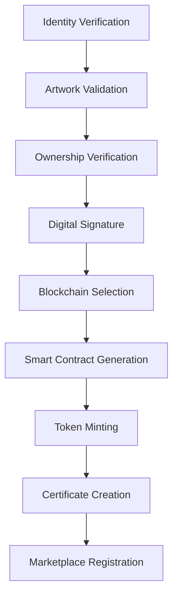
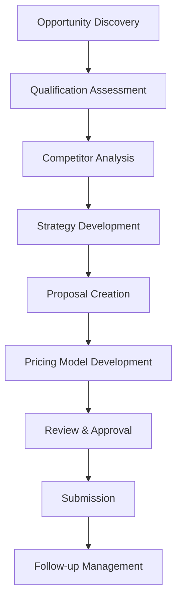
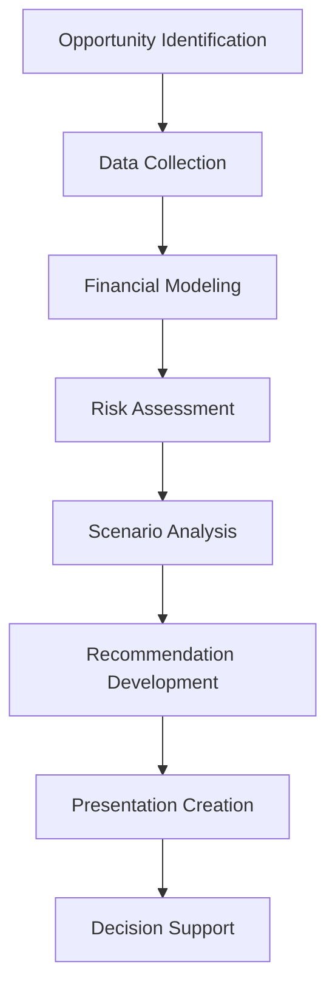

# Product-Specific S2DO Architecture

## 1. Product-Specific Implementation Map

| Product Name | Primary Function | S2DO Focus Areas | Custom Components |
|--------------|------------------|------------------|-------------------|
| **Anthology** | Knowledge compilation | Content curation, Version control | Custom taxonomy engine |
| **ROI Wish** | Return calculation | Financial modeling, Prediction | ML prediction models |
| **Dream Commander** | Strategic planning | Vision mapping, Resource allocation | Scenario simulation engine |
| **Bid Suite** | Bid management | Opportunity tracking, Proposal creation | Competitive analysis tools |
| **Brand Builder** | Brand management | Asset creation, Campaign tracking | Creative workflow tools |
| **Customer Delight** | Satisfaction metrics | Feedback collection, Sentiment analysis | Voice-of-customer engine |
| **Queen NFT Mint Mark** | NFT authentication | Identity verification, Blockchain minting | Secure token generation |
| **Marketplace Commander** | Market analysis | Trend identification, Competitor tracking | Real-time market scanner |
| **Sector Shield** | Industry protection | Threat detection, Opportunity alerts | Defensive strategy engine |
| **Venture Vault** | Investment tracking | Portfolio management, Performance metrics | Risk assessment tools |
| **Global Gateway** | International expansion | Market entry, Compliance tracking | Regional regulation database |

## 2. Queen NFT Mint Mark S2DO Implementation

### 2.1 Authentication & NFT Minting Workflow



### 2.2 Queen NFT Mint Mark S2DO Definition

```typescript
const queenNftMintMarkS2DO = {
  id: "queen-nft-mint-process",
  name: "Queen NFT Minting Workflow",
  version: "2.1.0",
  refreshCycle: 30, // days
  owner: "NFT Operations Team",
  steps: [
    {
      id: "identity-verification",
      name: "Creator Identity Verification",
      role: "Identity Verification Specialist",
      estimatedTimeMinutes: 30,
      required: true,
      artifacts: [
        {
          name: "Verified Identity Document",
          template: "templates/identity-verification.docx",
          required: true
        }
      ],
      automationLevel: "semi-automated",
      metrics: [
        {
          name: "Identity Verification Time",
          target: 15, // minutes
          critical: true
        }
      ]
    },
    {
      id: "artwork-validation",
      name: "Artwork Originality & Validation",
      role: "Digital Asset Specialist",
      estimatedTimeMinutes: 45,
      required: true,
      prerequisites: ["identity-verification"],
      artifacts: [
        {
          name: "Artwork Validation Report",
          template: "templates/artwork-validation.docx",
          required: true
        },
        {
          name: "Digital Fingerprint",
          type: "system-generated",
          required: true
        }
      ],
      automationLevel: "ai-assisted",
      metrics: [
        {
          name: "Plagiarism Detection Accuracy",
          target: 99.5, // percentage
          critical: true
        }
      ]
    },
    {
      id: "ownership-verification",
      name: "Intellectual Property Verification",
      role: "Legal Advisor",
      estimatedTimeMinutes: 60,
      required: true,
      prerequisites: ["artwork-validation"],
      artifacts: [
        {
          name: "Ownership Verification Document",
          template: "templates/ownership-verification.docx",
          required: true
        }
      ],
      automationLevel: "semi-automated",
      metrics: [
        {
          name: "Legal Compliance Score",
          target: 100, // percentage
          critical: true
        }
      ]
    },
    {
      id: "digital-signature",
      name: "Cryptographic Signature Creation",
      role: "Blockchain Specialist",
      estimatedTimeMinutes: 20,
      required: true,
      prerequisites: ["ownership-verification"],
      artifacts: [
        {
          name: "Digital Signature Record",
          type: "system-generated",
          required: true
        }
      ],
      automationLevel: "fully-automated",
      metrics: [
        {
          name: "Signature Generation Time",
          target: 5, // seconds
          critical: true
        }
      ]
    },
    {
      id: "blockchain-selection",
      name: "Optimal Blockchain Selection",
      role: "Blockchain Strategist",
      estimatedTimeMinutes: 30,
      required: true,
      prerequisites: ["digital-signature"],
      artifacts: [
        {
          name: "Blockchain Selection Report",
          template: "templates/blockchain-selection.docx",
          required: true
        }
      ],
      automationLevel: "ai-assisted",
      metrics: [
        {
          name: "Cost Efficiency Score",
          target: 85, // percentage
          critical: false
        }
      ]
    },
    {
      id: "smart-contract-generation",
      name: "Smart Contract Creation & Auditing",
      role: "Smart Contract Developer",
      estimatedTimeMinutes: 120,
      required: true,
      prerequisites: ["blockchain-selection"],
      artifacts: [
        {
          name: "Smart Contract Code",
          type: "code",
          required: true
        },
        {
          name: "Contract Audit Report",
          template: "templates/contract-audit.docx",
          required: true
        }
      ],
      automationLevel: "ai-assisted",
      metrics: [
        {
          name: "Security Score",
          target: 95, // percentage
          critical: true
        }
      ]
    },
    {
      id: "token-minting",
      name: "NFT Token Minting Process",
      role: "Minting Specialist",
      estimatedTimeMinutes: 45,
      required: true,
      prerequisites: ["smart-contract-generation"],
      artifacts: [
        {
          name: "Minting Transaction Record",
          type: "system-generated",
          required: true
        },
        {
          name: "Gas Fee Report",
          type: "system-generated",
          required: true
        }
      ],
      automationLevel: "fully-automated",
      metrics: [
        {
          name: "Minting Success Rate",
          target: 99.9, // percentage
          critical: true
        }
      ]
    },
    {
      id: "certificate-creation",
      name: "NFT Certificate Generation",
      role: "Documentation Specialist",
      estimatedTimeMinutes: 30,
      required: true,
      prerequisites: ["token-minting"],
      artifacts: [
        {
          name: "NFT Certificate",
          template: "templates/nft-certificate.docx",
          required: true
        },
        {
          name: "Provenance Document",
          template: "templates/provenance.docx",
          required: true
        }
      ],
      automationLevel: "semi-automated",
      metrics: [
        {
          name: "Documentation Completeness",
          target: 100, // percentage
          critical: true
        }
      ]
    },
    {
      id: "marketplace-registration",
      name: "Marketplace Listing Setup",
      role: "Marketplace Specialist",
      estimatedTimeMinutes: 60,
      required: false,
      prerequisites: ["certificate-creation"],
      artifacts: [
        {
          name: "Marketplace Listing Record",
          template: "templates/marketplace-listing.docx",
          required: true
        }
      ],
      automationLevel: "semi-automated",
      metrics: [
        {
          name: "Listing Optimization Score",
          target: 90, // percentage
          critical: false
        }
      ]
    }
  ],
  approvals: [
    {
      id: "legal-approval",
      name: "Legal Compliance Approval",
      role: "Legal Director",
      order: 1,
      required: true,
      timeoutHours: 24
    },
    {
      id: "security-approval",
      name: "Security Protocol Approval",
      role: "Security Officer",
      order: 2,
      required: true,
      timeoutHours: 24
    },
    {
      id: "executive-approval",
      name: "Executive Final Approval",
      role: "NFT Operations Director",
      order: 3,
      required: false,
      timeoutHours: 48,
      onlyRequired: {
        condition: "valueBased",
        threshold: 50000 // USD
      }
    }
  ],
  integrations: [
    {
      id: "ethereum-integration",
      name: "Ethereum Blockchain",
      connectionType: "api",
      refreshCycle: 30, // days
      configPath: "integrations/ethereum-config.json"
    },
    {
      id: "solana-integration", 
      name: "Solana Blockchain",
      connectionType: "api",
      refreshCycle: 30, // days
      configPath: "integrations/solana-config.json"
    },
    {
      id: "opensea-integration",
      name: "OpenSea Marketplace",
      connectionType: "api",
      refreshCycle: 30, // days
      configPath: "integrations/opensea-config.json"
    }
  ]
};
```

## 3. Bid Suite Custom S2DO Implementation

### 3.1 Bid Opportunity Workflow



### 3.2 Bid Suite S2DO Definition

```typescript
const bidSuiteS2DO = {
  id: "bid-management-process",
  name: "Bid Opportunity Management Workflow",
  version: "3.2.1",
  refreshCycle: 30, // days
  owner: "Bid Operations Team",
  steps: [
    {
      id: "opportunity-discovery",
      name: "Bid Opportunity Identification",
      role: "Market Intelligence Specialist",
      estimatedTimeMinutes: 60,
      required: true,
      artifacts: [
        {
          name: "Opportunity Brief",
          template: "templates/opportunity-brief.docx",
          required: true
        }
      ],
      automationLevel: "ai-assisted",
      metrics: [
        {
          name: "Opportunity Quality Score",
          target: 80, // percentage
          critical: true
        }
      ]
    },
    {
      id: "qualification-assessment",
      name: "Opportunity Qualification",
      role: "Bid Qualification Specialist",
      estimatedTimeMinutes: 90,
      required: true,
      prerequisites: ["opportunity-discovery"],
      artifacts: [
        {
          name: "Qualification Assessment",
          template: "templates/qualification-matrix.xlsx",
          required: true
        }
      ],
      automationLevel: "ai-assisted",
      metrics: [
        {
          name: "Go/No-Go Accuracy",
          target: 90, // percentage
          critical: true
        }
      ]
    },
    {
      id: "competitor-analysis",
      name: "Competitive Landscape Analysis",
      role: "Competitor Intelligence Analyst",
      estimatedTimeMinutes: 120,
      required: true,
      prerequisites: ["qualification-assessment"],
      artifacts: [
        {
          name: "Competitor Analysis Report",
          template: "templates/competitor-analysis.docx",
          required: true
        }
      ],
      automationLevel: "ai-assisted",
      metrics: [
        {
          name: "Competitor Insight Depth",
          target: 85, // percentage
          critical: true
        }
      ]
    },
    {
      id: "strategy-development",
      name: "Bid Strategy Development",
      role: "Bid Strategist",
      estimatedTimeMinutes: 120,
      required: true,
      prerequisites: ["competitor-analysis"],
      artifacts: [
        {
          name: "Bid Strategy Document",
          template: "templates/bid-strategy.docx",
          required: true
        }
      ],
      automationLevel: "semi-automated",
      metrics: [
        {
          name: "Strategy Clarity Score",
          target: 90, // percentage
          critical: true
        }
      ]
    },
    {
      id: "proposal-creation",
      name: "Proposal Development",
      role: "Proposal Writer",
      estimatedTimeMinutes: 240,
      required: true,
      prerequisites: ["strategy-development"],
      artifacts: [
        {
          name: "Draft Proposal",
          template: "templates/proposal-template.docx",
          required: true
        }
      ],
      automationLevel: "ai-assisted",
      metrics: [
        {
          name: "Content Quality Score",
          target: 95, // percentage
          critical: true
        }
      ]
    },
    {
      id: "pricing-model",
      name: "Pricing Model Development",
      role: "Financial Analyst",
      estimatedTimeMinutes: 120,
      required: true,
      prerequisites: ["strategy-development"],
      artifacts: [
        {
          name: "Pricing Model",
          template: "templates/pricing-model.xlsx",
          required: true
        }
      ],
      automationLevel: "semi-automated",
      metrics: [
        {
          name: "Profit Margin Protection",
          target: 95, // percentage
          critical: true
        }
      ]
    },
    {
      id: "review-approval",
      name: "Proposal Review & Approval",
      role: "Bid Review Committee",
      estimatedTimeMinutes: 180,
      required: true,
      prerequisites: ["proposal-creation", "pricing-model"],
      artifacts: [
        {
          name: "Review Feedback Document",
          template: "templates/review-feedback.docx",
          required: true
        }
      ],
      automationLevel: "partially-automated",
      metrics: [
        {
          name: "Error Detection Rate",
          target: 98, // percentage
          critical: true
        }
      ]
    },
    {
      id: "submission",
      name: "Bid Submission Process",
      role: "Submission Specialist",
      estimatedTimeMinutes: 60,
      required: true,
      prerequisites: ["review-approval"],
      artifacts: [
        {
          name: "Submission Confirmation",
          type: "system-generated",
          required: true
        }
      ],
      automationLevel: "semi-automated",
      metrics: [
        {
          name: "On-time Submission Rate",
          target: 100, // percentage
          critical: true
        }
      ]
    },
    {
      id: "followup-management",
      name: "Post-Submission Follow-up",
      role: "Account Manager",
      estimatedTimeMinutes: 120,
      required: false,
      prerequisites: ["submission"],
      artifacts: [
        {
          name: "Follow-up Activity Log",
          template: "templates/followup-log.docx",
          required: true
        }
      ],
      automationLevel: "semi-automated",
      metrics: [
        {
          name: "Client Engagement Score",
          target: 85, // percentage
          critical: false
        }
      ]
    }
  ],
  approvals: [
    {
      id: "technical-approval",
      name: "Technical Solution Approval",
      role: "Technical Director",
      order: 1,
      required: true,
      timeoutHours: 24
    },
    {
      id: "financial-approval",
      name: "Financial Model Approval",
      role: "Finance Director",
      order: 2,
      required: true,
      timeoutHours: 24
    },
    {
      id: "executive-approval",
      name: "Executive Bid Approval",
      role: "Executive Sponsor",
      order: 3,
      required: true,
      timeoutHours: 48
    }
  ],
  integrations: [
    {
      id: "crm-integration",
      name: "CRM System",
      connectionType: "api",
      refreshCycle: 30, // days
      configPath: "integrations/crm-config.json"
    },
    {
      id: "financial-integration", 
      name: "Financial Analysis Tools",
      connectionType: "api",
      refreshCycle: 30, // days
      configPath: "integrations/financial-tools-config.json"
    },
    {
      id: "document-management-integration",
      name: "Document Management System",
      connectionType: "api",
      refreshCycle: 30, // days
      configPath: "integrations/dms-config.json"
    }
  ]
};
```

## 4. ROI Wish/Dream Commander S2DO Implementation

### 4.1 ROI Analysis Workflow



### 4.2 ROI Wish/Dream Commander S2DO Definition

```typescript
const roiWishDreamS2DO = {
  id: "roi-analysis-process",
  name: "ROI Analysis & Strategic Planning Workflow",
  version: "2.5.0",
  refreshCycle: 30, // days
  owner: "Financial Strategy Team",
  steps: [
    {
      id: "opportunity-identification",
      name: "Strategic Opportunity Identification",
      role: "Business Analyst",
      estimatedTimeMinutes: 120,
      required: true,
      artifacts: [
        {
          name: "Opportunity Definition Document",
          template: "templates/opportunity-definition.docx",
          required: true
        }
      ],
      automationLevel: "ai-assisted",
      metrics: [
        {
          name: "Strategic Alignment Score",
          target: 90, // percentage
          critical: true
        }
      ]
    },
    {
      id: "data-collection",
      name: "Financial & Operational Data Collection",
      role: "Data Analyst",
      estimatedTimeMinutes: 180,
      required: true,
      prerequisites: ["opportunity-identification"],
      artifacts: [
        {
          name: "Data Collection Report",
          template: "templates/data-collection.xlsx",
          required: true
        }
      ],
      automationLevel: "semi-automated",
      metrics: [
        {
          name: "Data Completeness",
          target: 95, // percentage
          critical: true
        }
      ]
    },
    {
      id: "financial-modeling",
      name: "Financial Model Development",
      role: "Financial Modeler",
      estimatedTimeMinutes: 240,
      required: true,
      prerequisites: ["data-collection"],
      artifacts: [
        {
          name: "ROI Financial Model",
          template: "templates/roi-model.xlsx",
          required: true
        }
      ],
      automationLevel: "semi-automated",
      metrics: [
        {
          name: "Model Accuracy",
          target: 95, // percentage
          critical: true
        }
      ]
    },
    {
      id: "risk-assessment",
      name: "Risk Analysis & Mitigation",
      role: "Risk Analyst",
      estimatedTimeMinutes: 120,
      required: true,
      prerequisites: ["financial-modeling"],
      artifacts: [
        {
          name: "Risk Assessment Matrix",
          template: "templates/risk-matrix.xlsx",
          required: true
        }
      ],
      automationLevel: "ai-assisted",
      metrics: [
        {
          name: "Risk Identification Completeness",
          target: 90, // percentage
          critical: true
        }
      ]
    },
    {
      id: "scenario-analysis",
      name: "Scenario Planning & Analysis",
      role: "Strategic Planner",
      estimatedTimeMinutes: 180,
      required: true,
      prerequisites: ["financial-modeling", "risk-assessment"],
      artifacts: [
        {
          name: "Scenario Analysis Report",
          template: "templates/scenario-analysis.docx",
          required: true
        }
      ],
      automationLevel: "ai-assisted",
      metrics: [
        {
          name: "Scenario Breadth",
          target: 95, // percentage
          critical: true
        }
      ]
    },
    {
      id: "recommendation-development",
      name: "Strategic Recommendation Development",
      role: "Strategy Consultant",
      estimatedTimeMinutes: 120,
      required: true,
      prerequisites: ["scenario-analysis"],
      artifacts: [
        {
          name: "Strategic Recommendation Document",
          template: "templates/strategic-recommendation.docx",
          required: true
        }
      ],
      automationLevel: "ai-assisted",
      metrics: [
        {
          name: "Recommendation Quality Score",
          target: 95, // percentage
          critical: true
        }
      ]
    },
    {
      id: "presentation-creation",
      name: "Executive Presentation Development",
      role: "Communication Specialist",
      estimatedTimeMinutes: 120,
      required: true,
      prerequisites: ["recommendation-development"],
      artifacts: [
        {
          name: "Executive Presentation",
          template: "templates/executive-presentation.pptx",
          required: true
        }
      ],
      automationLevel: "semi-automated",
      metrics: [
        {
          name: "Communication Clarity",
          target: 95, // percentage
          critical: true
        }
      ]
    },
    {
      id: "decision-support",
      name: "Executive Decision Support",
      role: "Executive Advisor",
      estimatedTimeMinutes: 90,
      required: false,
      prerequisites: ["presentation-creation"],
      artifacts: [
        {
          name: "Decision Support Package",
          template: "templates/decision-support.docx",
          required: true
        }
      ],
      automationLevel: "partially-automated",
      metrics: [
        {
          name: "Decision Quality Score",
          target: 90, // percentage
          critical: true
        }
      ]
    }
  ],
  approvals: [
    {
      id: "financial-approval",
      name: "Financial Model Approval",
      role: "Finance Director",
      order: 1,
      required: true,
      timeoutHours: 24
    },
    {
      id: "strategy-approval",
      name: "Strategic Alignment Approval",
      role: "Strategy Director",
      order: 2,
      required: true,
      timeoutHours: 24
    },
    {
      id: "executive-approval",
      name: "Executive ROI Approval",
      role: "C-Suite Executive",
      order: 3,
      required: true,
      timeoutHours: 72
    }
  ],
  integrations: [
    {
      id: "financial-data-integration",
      name: "Financial Data Systems",
      connectionType: "api",
      refreshCycle: 30, // days
      configPath: "integrations/financial-data-config.json"
    },
    {
      id: "market-data-integration", 
      name: "Market Intelligence Platform",
      connectionType: "api",
      refreshCycle: 30, // days
      configPath: "integrations/market-data-config.json"
    },
    {
      id: "bi-integration",
      name: "Business Intelligence Platform",
      connectionType: "api",
      refreshCycle: 30, // days
      configPath: "integrations/bi-platform-config.json"
    }
  ]
};
```

## 5. Joint Services Layer Implementation

The Joint Services Layer integrates all products while allowing for product-specific customization:

```typescript
interface JointServicesConfig {
  coreServices: {
    authentication: {
      provider: string;
      refreshCycle: number;
      mfaRequired: boolean;
      sessionTimeout: number;
      integrations: string[];
    };
    dataStorage: {
      primaryProvider: string;
      backupProvider: string;
      encryptionLevel: string;
      retentionPolicy: string;
      refreshCycle: number;
    };
    analytics: {
      provider: string;
      refreshCycle: number;
      realTimeEnabled: boolean;
      historicalDataMonths: number;
    };
    notification: {
      providers: string[];
      defaultChannels: string[];
      criticality: string[];
      refreshCycle: number;
    };
    vectorDatabase: {
      provider: string;
      indexes: VectorIndex[];
      refreshCycle: number;
      embeddingModel: string;
      dimension: number;
    };
  };
  productSpecificServices: {
    "queen-nft-mint-mark": {
      blockchainServices: {
        providers: string[];
        gasOptimization: boolean;
        smartContractLibrary: string;
        refreshCycle: number;
      };
      securityServices: {
        encryptionProtocol: string;
        auditFrequency: number;
        securityScanners: string[];
        refreshCycle: number;
      };
      nftRegistrationServices: {
        marketplaces: string[];
        metadataStandard: string;
        refreshCycle: number;
      };
    };
    "bid-suite": {
      opportunityDiscoveryServices: {
        sources: string[];
        refreshFrequency: number;
        keywordSets: string[][];
        filterCriteria: object;
      };
      proposalGenerationServices: {
        templates: string[];
        aiAssistanceLevel: string;
        refreshCycle: number;
      };
      competitiveAnalysisServices: {
        dataSources: string[];
        analysisDepth: string;
        refreshCycle: number;
      };
    };
    "roi-wish": {
      financialModelingServices: {
        modelTemplates: string[];
        calculationEngine: string;
        refreshCycle: number;
      };
      riskAnalysisServices: {
        methodologies: string[];
        dataPoints: string[];
        refreshCycle: number;
      };
      scenarioPlanningServices: {
        scenarioCount: number;
        variableFactors: string[];
        refreshCycle: number;
      };
    };
    // Additional product-specific services for other products
  };
  s2doImplementations: {
    "queen-nft-mint-mark": object; // Full S2DO definition
    "bid-suite": object; // Full S2DO definition
    "roi-wish": object; // Full S2DO definition
    // Additional S2DO implementations for other products
  };
  refreshManagement: {
    schedule: {
      type: string; // "fixed" or "dynamic"
      interval: number; // days
      staggered: boolean;
      maintenanceWindow: string;
    };
    dependencies: {
      externalLibraries: object[];
      apiEndpoints: object[];
      dataFeeds: object[];
    };
    versionControl: {
      strategy: string;
      taggingConvention: string;
      approvalWorkflow: string;
    };
    rollbackProcedure: {
      automatedTesting: boolean;
      healthCheckEndpoints: string[];
      canaryDeployment: boolean;
    };
  };
}

// Implementation config for the Joint Services Layer
const jointServicesConfig: JointServicesConfig = {
  coreServices: {
    authentication: {
      provider: "Auth0",
      refreshCycle: 30, // days
      mfaRequired: true,
      sessionTimeout: 120, // minutes
      integrations: ["Azure AD", "Google Workspace", "Okta"]
    },
    dataStorage: {
      primaryProvider: "AWS S3",
      backupProvider: "Azure Blob Storage",
      encryptionLevel: "AES-256",
      retentionPolicy: "7-year",
      refreshCycle: 30 // days
    },
    analytics: {
      provider: "Mixpanel",
      refreshCycle: 30, // days
      realTimeEnabled: true,
      historicalDataMonths: 36
    },
    notification: {
      providers: ["SendGrid", "Twilio", "Firebase"],
      defaultChannels: ["email", "push", "in-app"],
      criticality: ["critical", "important", "informational"],
      refreshCycle: 30 // days
    },
    vectorDatabase: {
      provider: "Pinecone",
      indexes: [
        {
          name: "bid-opportunities",
          dimensions: 1536,
          metric: "cosine"
        },
        {
          name: "market-intelligence",
          dimensions: 1536,
          metric: "cosine"
        },
        {
          name: "nft-assets",
          dimensions: 1536,
          metric: "cosine"
        }
      ],
      refreshCycle: 30, // days
      embeddingModel: "OpenAI-text-embedding-ada-002",
      dimension: 1536
    }
  },
  productSpecificServices: {
    "queen-nft-mint-mark": {
      blockchainServices: {
        providers: ["Ethereum", "Solana", "Polygon"],
        gasOptimization: true,
        smartContractLibrary: "OpenZeppelin",
        refreshCycle: 30 // days
      },
      securityServices: {
        encryptionProtocol: "ECC",
        auditFrequency: 30, // days
        securityScanners: ["Mythril", "Slither", "MythX"],
        refreshCycle: 30 // days
      },
      nftRegistrationServices: {
        marketplaces: ["OpenSea", "Rarible", "Foundation"],
        metadataStandard: "ERC-721",
        refreshCycle: 30 // days
      }
    },
    "bid-suite": {
      opportunityDiscoveryServices: {
        sources: ["FBO.gov", "SAM.gov", "TenderBoard", "EU-Supply"],
        refreshFrequency: 24, // hours
        keywordSets: [
          ["healthcare", "medical", "hospital"],
          ["technology", "IT", "software"],
          ["construction", "infrastructure", "building"]
        ],
        filterCriteria: {
          minValue: 100000,
          regions: ["North America", "Europe", "APAC"],
          contractTypes: ["fixed", "time-materials", "cost-plus"]
        }
      },
      proposalGenerationServices: {
        templates: ["government", "commercial", "healthcare", "education"],
        aiAssistanceLevel: "high",
        refreshCycle: 30 // days
      },
      competitiveAnalysisServices: {
        dataSources: ["LinkedIn", "Crunchbase", "D&B Hoovers", "Bloomberg"],
        analysisDepth: "comprehensive",
        refreshCycle: 30 // days
      }
    },
    "roi-wish": {
      financialModelingServices: {
        modelTemplates: ["technology-saas", "manufacturing", "healthcare", "retail"],
        calculationEngine: "Python-Pandas",
        refreshCycle: 30 // days
      },
      riskAnalysisServices: {
        methodologies: ["Monte Carlo", "SWOT", "PESTLE", "Porter's Five Forces"],
        dataPoints: ["market-volatility", "competitor-actions", "regulatory-changes"],
        refreshCycle: 30 // days
      },
      scenarioPlanningServices: {
        scenarioCount: 5,
        variableFactors: ["market-growth", "price-sensitivity", "adoption-rate"],
        refreshCycle: 30 // days
      }
    }
    // Additional product-specific services for other products
  },
  s2doImplementations: {
    "queen-nft-mint-mark": queenNftMintMarkS2DO,
    "bid-suite": bidSuiteS2DO,
    "roi-wish": roiWishDreamS2DO
    // Additional S2DO implementations for other products
  },
  refreshManagement: {
    schedule: {
      type: "fixed",
      interval: 30, // days
      staggered: true,
      maintenanceWindow: "weekend"
    },
    dependencies: {
      externalLibraries: [
        { name: "OpenZeppelin", versionStrategy: "n-1", refreshCycle: 30 },
        { name: "Ethers.js", versionStrategy: "latest-stable", refreshCycle: 30 },
        { name: "Firebase SDK", versionStrategy: "latest-stable", refreshCycle: 30 }
      ],
      apiEndpoints: [
        { name: "Ethereum API", versionStrategy: "compatible", refreshCycle: 30 },
        { name: "OpenSea API", versionStrategy: "latest", refreshCycle: 30 },
        { name: "FBO API", versionStrategy: "stable", refreshCycle: 30 }
      ],
      dataFeeds: [
        { name: "Market Data", versionStrategy: "real-time", refreshCycle: 1 },
        { name: "Bid Opportunities", versionStrategy: "daily", refreshCycle: 1 },
        { name: "Competitor Actions", versionStrategy: "daily", refreshCycle: 1 }
      ]
    },
    versionControl: {
      strategy: "semantic-versioning",
      taggingConvention: "v{major}.{minor}.{patch}",
      approvalWorkflow: "gitflow"
    },
    rollbackProcedure: {
      automatedTesting: true,
      healthCheckEndpoints: ["/api/health", "/api/status", "/api/metrics"],
      canaryDeployment: true
    }
  }
};
```

## 6. Crawler Integration for Sector-Specific Intelligence

```typescript
interface SectorCrawlerConfig {
  id: string;
  name: string;
  sectors: string[];
  dataTypes: string[];
  sources: {
    rssFeeds: RssFeedConfig[];
    apis: ApiConfig[];
    webSources: WebSourceConfig[];
  };
  processingRules: {
    keywordSets: KeywordSet[];
    categorization: CategorizationRule[];
    filtering: FilterRule[];
    enrichment: EnrichmentRule[];
  };
  outputDestinations: {
    vectorDb: VectorDbConfig;
    googleDrive: GoogleDriveConfig;
    notificationTargets: NotificationTarget[];
  };
  schedule: {
    frequency: string;
    refreshWindow: number; // in hours
    priorityLevel: number;
  };
  fieldOperationConfig: {
    offlineCapability: boolean;
    batchUploadSize: number;
    connectionRetryStrategy: string;
  };
}

// Implementation for Queen NFT Sector Crawler
const queenNftSectorCrawler: SectorCrawlerConfig = {
  id: "nft-market-crawler",
  name: "NFT Market Intelligence Crawler",
  sectors: ["digital-art", "collectibles", "gaming", "metaverse"],
  dataTypes: ["market-trends", "pricing-data", "artist-movements", "platform-updates"],
  sources: {
    rssFeeds: [
      {
        url: "https://opensea.io/blog/feed",
        priority: "high",
        refreshRate: "hourly"
      },
      {
        url: "https://nonfungible.com/rss",
        priority: "medium",
        refreshRate: "daily"
      },
      {
        url: "https://decrypt.co/nft/feed",
        priority: "medium",
        refreshRate: "daily"
      }
    ],
    apis: [
      {
        name: "OpenSea API",
        baseUrl: "https://api.opensea.io/api/v1",
        endpoints: [
          "/collections?offset={offset}&limit={limit}",
          "/assets?order_by=sale_price&order_direction=desc&offset={offset}&limit={limit}"
        ],
        authType: "api-key",
        refreshRate: "hourly",
        parameters: {
          offset: "0",
          limit: "50"
        }
      },
      {
        name: "Rarible API",
        baseUrl: "https://api.rarible.org/v0.1",
        endpoints: [
          "/data/collections/all",
          "/data/items/byCollection?collection={collection}"
        ],
        authType: "oauth",
        refreshRate: "daily"
      }
    ],
    webSources: [
      {
        url: "https://nft.reddit.com",
        selectors: [
          {
            name: "trending-posts",
            path: ".Post.trending"
          },
          {
            name: "user-comments",
            path: ".Comment-body"
          }
        ],
        frequency: "daily",
        userAgent: "Mozilla/5.0 (compatible; NFTCrawler/1.0)"
      }
    ]
  },
  processingRules: {
    keywordSets: [
      {
        name: "market-trends",
        keywords: ["floor price", "market cap", "trading volume", "liquidity", "whale"],
        importance: "high"
      },
      {
        name: "artist-movements",
        keywords: ["artist", "creator", "drop", "mint", "collection", "collaboration"],
        importance: "medium"
      }
    ],
    categorization: [
      {
        name: "market-intelligence",
        rules: [
          {
            pattern: "\\b(floor|price|market|cap|volume|trade)\\b",
            category: "market-metrics",
            confidence: 0.8
          }
        ]
      }
    ],
    filtering: [
      {
        name: "spam-filter",
        rules: [
          {
            pattern: "\\b(giveaway|airdrop|free mint|win)\\b",
            action: "flag",
            threshold: 0.7
          }
        ]
      }
    ],
    enrichment: [
      {
        name: "sentiment-analysis",
        type: "nlp",
        parameters: {
          model: "distilbert-base-uncased-finetuned-sst-2-english",
          confidence: 0.7
        }
      }
    ]
  },
  outputDestinations: {
    vectorDb: {
      provider: "pinecone",
      index: "nft-market-intelligence",
      namespace: "market-trends",
      embeddingModel: "text-embedding-ada-002"
    },
    googleDrive: {
      enabled: true,
      folderPath: "/NFT Market Intelligence/daily-feeds",
      format: "markdown",
      structure: "dated-folders"
    },
    notificationTargets: [
      {
        type: "email",
        recipients: ["nft-team@company.com"],
        frequency: "daily-digest",
        threshold: "important"
      },
      {
        type: "slack",
        channel: "#nft-market-updates",
        frequency: "real-time",
        threshold: "critical"
      }
    ]
  },
  schedule: {
    frequency: "hourly",
    refreshWindow: 4,
    priorityLevel: 1
  },
  fieldOperationConfig: {
    offlineCapability: true,
    batchUploadSize: 50,
    connectionRetryStrategy: "exponential-backoff"
  }
};

// Implementation for Bid Suite Sector Crawler
const bidSuiteSectorCrawler: SectorCrawlerConfig = {
  id: "bid-opportunity-crawler",
  name: "Bid Opportunity Intelligence Crawler",
  sectors: ["government", "healthcare", "education", "infrastructure", "defense"],
  dataTypes: ["rfp", "rfq", "tender", "contract-award", "pre-solicitation"],
  sources: {
    rssFeeds: [
      {
        url: "https://sam.gov/opportunities/public?status=active&format=rss",
        priority: "high",
        refreshRate: "hourly"
      },
      {
        url: "https://www.fbo.gov/rss",
        priority: "high",
        refreshRate: "hourly"
      },
      {
        url: "https://ted.europa.eu/TED/rss/RSS_2.0_ted_EN.xml",
        priority: "medium",
        refreshRate: "daily"
      }
    ],
    apis: [
      {
        name: "SAM.gov API",
        baseUrl: "https://api.sam.gov/opportunities/v1",
        endpoints: [
          "/search?api_key={api_key}&postedFrom={from_date}",
          "/detail/{opportunity_id}?api_key={api_key}"
        ],
        authType: "api-key",
        refreshRate: "hourly"
      },
      {
        name: "GovTribe API",
        baseUrl: "https://api.govtribe.com/v1",
        endpoints: [
          "/project?page={page}",
          "/project/{id}"
        ],
        authType: "oauth",
        refreshRate: "daily"
      }
    ],
    webSources: [
      {
        url: "https://govconwire.com/category/contract-awards/",
        selectors: [
          {
            name: "award-headlines",
            path: "article h2.entry-title a"
          },
          {
            name: "award-content",
            path: "article .entry-content"
          }
        ],
        frequency: "daily",
        userAgent: "Mozilla/5.0 (compatible; BidCrawler/1.0)"
      }
    ]
  },
  processingRules: {
    keywordSets: [
      {
        name: "opportunity-identification",
        keywords: ["RFP", "RFQ", "RFI", "solicitation", "tender", "contract", "procurement"],
        importance: "high"
      },
      {
        name: "value-indicators",
        keywords: ["budget", "estimate", "value", "amount", "million", "billion", "dollar"],
        importance: "high"
      }
    ],
    categorization: [
      {
        name: "sector-classification",
        rules: [
          {
            pattern: "\\b(health|hospital|medical|patient|care)\\b",
            category: "healthcare",
            confidence: 0.8
          },
          {
            pattern: "\\b(defense|military|weapon|army|navy|air force)\\b",
            category: "defense",
            confidence: 0.9
          }
        ]
      }
    ],
    filtering: [
      {
        name: "value-filter",
        rules: [
          {
            pattern: "\\$([0-9]{1,3},([0-9]{3},)*[0-9]{3}|[0-9]+)(\\.[0-9][0-9])?",
            action: "extract",
            threshold: 0.7
          }
        ]
      }
    ],
    enrichment: [
      {
        name: "win-probability",
        type: "ml-prediction",
        parameters: {
          model: "bid-probability-predictor-v2",
          confidence: 0.7,
          fields: ["description", "requirements", "agency", "value"]
        }
      }
    ]
  },
  outputDestinations: {
    vectorDb: {
      provider: "pinecone",
      index: "bid-opportunities",
      namespace: "active-bids",
      embeddingModel: "text-embedding-ada-002"
    },
    googleDrive: {
      enabled: true,
      folderPath: "/Bid Opportunities/daily-feeds",
      format: "spreadsheet",
      structure: "sector-folders"
    },
    notificationTargets: [
      {
        type: "email",
        recipients: ["bid-team@company.com"],
        frequency: "hourly-digest",
        threshold: "important"
      },
      {
        type: "slack",
        channel: "#bid-opportunities",
        frequency: "real-time",
        threshold: "critical"
      }
    ]
  },
  schedule: {
    frequency: "hourly",
    refreshWindow: 2,
    priorityLevel: 1
  },
  fieldOperationConfig: {
    offlineCapability: true,
    batchUploadSize: 100,
    connectionRetryStrategy: "exponential-backoff"
  }
};

// Implementation for ROI Wish Sector Crawler
const roiWishSectorCrawler: SectorCrawlerConfig = {
  id: "market-trends-crawler",
  name: "Market Trends & ROI Intelligence Crawler",
  sectors: ["finance", "technology", "healthcare", "retail", "manufacturing"],
  dataTypes: ["market-report", "financial-data", "competitor-movement", "investment-trend"],
  sources: {
    rssFeeds: [
      {
        url: "https://www.fool.com/feeds/index.aspx?id=foolwatch&format=rss",
        priority: "medium",
        refreshRate: "daily"
      },
      {
        url: "https://seekingalpha.com/market_currents.xml",
        priority: "high",
        refreshRate: "hourly"
      },
      {
        url: "https://www.investopedia.com/feedbuilder/feed/getfeed?feedName=rss_articles",
        priority: "medium",
        refreshRate: "daily"
      }
    ],
    apis: [
      {
        name: "Alpha Vantage API",
        baseUrl: "https://www.alphavantage.co/query",
        endpoints: [
          "?function=TIME_SERIES_DAILY&symbol={symbol}&apikey={api_key}",
          "?function=SECTOR&apikey={api_key}"
        ],
        authType: "api-key",
        refreshRate: "daily"
      },
      {
        name: "Yahoo Finance API",
        baseUrl: "https://yfapi.net",
        endpoints: [
          "/v6/finance/quote?symbols={symbols}",
          "/v11/finance/quoteSummary/{symbol}?modules=defaultKeyStatistics,financialData"
        ],
        authType: "api-key",
        refreshRate: "daily"
      }
    ],
    webSources: [
      {
        url: "https://www.bloomberg.com/markets",
        selectors: [
          {
            name: "market-headlines",
            path: "article h3.story-package-module__story__headline"
          },
          {
            name: "market-content",
            path: "article .story-package-module__story__summary"
          }
        ],
        frequency: "daily",
        userAgent: "Mozilla/5.0 (compatible; ROICrawler/1.0)"
      }
    ]
  },
  processingRules: {
    keywordSets: [
      {
        name: "financial-metrics",
        keywords: ["ROI", "return", "margin", "profit", "EBITDA", "revenue", "growth"],
        importance: "high"
      },
      {
        name: "market-indicators",
        keywords: ["market share", "expansion", "acquisition", "merger", "partnership"],
        importance: "high"
      }
    ],
    categorization: [
      {
        name: "trend-classification",
        rules: [
          {
            pattern: "\\b(grow(th|ing)|increase|rise|rising|up)\\b",
            category: "positive-trend",
            confidence: 0.8
          },
          {
            pattern: "\\b(decline|decrease|fall|falling|down|shrink)\\b",
            category: "negative-trend",
            confidence: 0.8
          }
        ]
      }
    ],
    filtering: [
      {
        name: "metric-filter",
        rules: [
          {
            pattern: "\\b([0-9]{1,2}(\\.\\d+)?)\\s*%",
            action: "extract",
            threshold: 0.7
          }
        ]
      }
    ],
    enrichment: [
      {
        name: "roi-prediction",
        type: "ml-prediction",
        parameters: {
          model: "roi-predictor-v3",
          confidence: 0.7,
          fields: ["market-trend", "growth-rate", "competitor-action", "investment-level"]
        }
      }
    ]
  },
  outputDestinations: {
    vectorDb: {
      provider: "pinecone",
      index: "market-intelligence",
      namespace: "financial-trends",
      embeddingModel: "text-embedding-ada-002"
    },
    googleDrive: {
      enabled: true,
      folderPath: "/Market Intelligence/trend-analysis",
      format: "dashboard",
      structure: "sector-folders"
    },
    notificationTargets: [
      {
        type: "email",
        recipients: ["strategy-team@company.com"],
        frequency: "daily-digest",
        threshold: "important"
      },
      {
        type: "slack",
        channel: "#market-trends",
        frequency: "real-time",
        threshold: "critical"
      }
    ]
  },
  schedule: {
    frequency: "daily",
    refreshWindow: 6,
    priorityLevel: 2
  },
  fieldOperationConfig: {
    offlineCapability: true,
    batchUploadSize: 75,
    connectionRetryStrategy: "exponential-backoff"
  }
};
```

## 7. AI Workflow Integration

Each product's S2DO is implemented with specific AI workflow handoffs between Co-Pilot, Dr. Claude 1 (review), Dr. Claude 2 (build/test), QA 02, and Dr. Claude 3 (client engagement):

```typescript
interface AIWorkflowConfig {
  id: string;
  name: string;
  product: string;
  participants: {
    id: string;
    name: string;
    role: string;
    capabilities: string[];
    handoffProtocol: HandoffProtocol;
  }[];
  transitions: {
    from: string;
    to: string;
    triggers: string[];
    artifacts: string[];
    approvalRequired: boolean;
    automationLevel: string;
  }[];
  metrics: {
    name: string;
    description: string;
    target: number;
    unit: string;
    critical: boolean;
  }[];
}

// Implementation for Queen NFT Mint Mark AI Workflow
const queenNftAIWorkflow: AIWorkflowConfig = {
  id: "queen-nft-ai-workflow",
  name: "Queen NFT Minting AI Workflow",
  product: "queen-nft-mint-mark",
  participants: [
    {
      id: "co-pilot",
      name: "Co-Pilot",
      role: "Client Interface & Requirements",
      capabilities: ["client-interaction", "requirement-gathering", "initial-validation"],
      handoffProtocol: {
        format: "structured-json",
        validationSteps: ["schema-validation", "content-validation"],
        acknowledgmentRequired: true
      }
    },
    {
      id: "dr-claude-1",
      name: "Dr. Claude 1",
      role: "Technical Review & Solution Design",
      capabilities: ["artwork-validation", "ownership-verification", "compliance-check"],
      handoffProtocol: {
        format: "structured-json",
        validationSteps: ["artwork-validation", "legal-validation"],
        acknowledgmentRequired: true
      }
    },
    {
      id: "dr-claude-2",
      name: "Dr. Claude 2",
      role: "Implementation & Testing",
      capabilities: ["smart-contract-creation", "token-minting", "security-testing"],
      handoffProtocol: {
        format: "structured-json",
        validationSteps: ["code-validation", "security-scan"],
        acknowledgmentRequired: true
      }
    },
    {
      id: "qa-02",
      name: "QA 02",
      role: "Quality Assurance",
      capabilities: ["verification-testing", "compliance-validation", "documentation-review"],
      handoffProtocol: {
        format: "structured-json",
        validationSteps: ["test-coverage-check", "compliance-verification"],
        acknowledgmentRequired: true
      }
    },
    {
      id: "dr-claude-3",
      name: "Dr. Claude 3",
      role: "Client Engagement & Delivery",
      capabilities: ["client-documentation", "marketplace-listing", "certificate-creation"],
      handoffProtocol: {
        format: "structured-json",
        validationSteps: ["documentation-validation", "delivery-readiness"],
        acknowledgmentRequired: true
      }
    }
  ],
  transitions: [
    {
      from: "co-pilot",
      to: "dr-claude-1",
      triggers: ["requirements-complete", "identity-verified", "initial-validation-passed"],
      artifacts: ["client-requirements-doc", "identity-verification-results"],
      approvalRequired: false,
      automationLevel: "fully-automated"
    },
    {
      from: "dr-claude-1",
      to: "dr-claude-2",
      triggers: ["artwork-validated", "ownership-verified", "compliance-checked"],
      artifacts: ["artwork-validation-report", "ownership-verification-doc", "compliance-report"],
      approvalRequired: true,
      automationLevel: "semi-automated"
    },
    {
      from: "dr-claude-2",
      to: "qa-02",
      triggers: ["smart-contract-created", "security-tested", "token-prepared"],
      artifacts: ["smart-contract-code", "security-test-results", "token-metadata"],
      approvalRequired: false,
      automationLevel: "fully-automated"
    },
    {
      from: "qa-02",
      to: "dr-claude-3",
      triggers: ["verification-complete", "compliance-validated", "documentation-approved"],
      artifacts: ["verification-report", "compliance-certificate", "testing-documentation"],
      approvalRequired: true,
      automationLevel: "semi-automated"
    },
    {
      from: "dr-claude-3",
      to: "co-pilot",
      triggers: ["client-docs-prepared", "marketplace-listing-ready", "certificate-created"],
      artifacts: ["client-documentation", "marketplace-listing", "nft-certificate"],
      approvalRequired: false,
      automationLevel: "fully-automated"
    }
  ],
  metrics: [
    {
      name: "total-processing-time",
      description: "Total time from initial request to delivery",
      target: 240, // minutes
      unit: "minutes",
      critical: true
    },
    {
      name: "first-time-success-rate",
      description: "Percentage of NFTs minted successfully on first attempt",
      target: 99,
      unit: "percentage",
      critical: true
    },
    {
      name: "human-intervention-rate",
      description: "Percentage of processes requiring human intervention",
      target: 5,
      unit: "percentage",
      critical: false
    }
  ]
};

// Implementation for Bid Suite AI Workflow
const bidSuiteAIWorkflow: AIWorkflowConfig = {
  id: "bid-suite-ai-workflow",
  name: "Bid Suite AI Workflow",
  product: "bid-suite",
  participants: [
    {
      id: "co-pilot",
      name: "Co-Pilot",
      role: "Client Interface & Requirements",
      capabilities: ["client-interaction", "opportunity-identification", "initial-assessment"],
      handoffProtocol: {
        format: "structured-json",
        validationSteps: ["schema-validation", "content-validation"],
        acknowledgmentRequired: true
      }
    },
    {
      id: "dr-claude-1",
      name: "Dr. Claude 1",
      role: "Technical Review & Strategy",
      capabilities: ["opportunity-qualification", "competitor-analysis", "win-strategy-formulation"],
      handoffProtocol: {
        format: "structured-json",
        validationSteps: ["opportunity-validation", "strategy-validation"],
        acknowledgmentRequired: true
      }
    },
    {
      id: "dr-claude-2",
      name: "Dr. Claude 2",
      role: "Implementation & Testing",
      capabilities: ["proposal-development", "pricing-model-creation", "response-optimization"],
      handoffProtocol: {
        format: "structured-json",
        validationSteps: ["proposal-completeness", "pricing-accuracy"],
        acknowledgmentRequired: true
      }
    },
    {
      id: "qa-02",
      name: "QA 02",
      role: "Quality Assurance",
      capabilities: ["content-review", "compliance-validation", "win-theme-verification"],
      handoffProtocol: {
        format: "structured-json",
        validationSteps: ["compliance-check", "quality-verification"],
        acknowledgmentRequired: true
      }
    },
    {
      id: "dr-claude-3",
      name: "Dr. Claude 3",
      role: "Client Engagement & Delivery",
      capabilities: ["proposal-finalization", "client-presentation", "bid-submission"],
      handoffProtocol: {
        format: "structured-json",
        validationSteps: ["final-proposal-validation", "submission-readiness"],
        acknowledgmentRequired: true
      }
    }
  ],
  transitions: [
    {
      from: "co-pilot",
      to: "dr-claude-1",
      triggers: ["opportunity-identified", "requirements-gathered", "initial-assessment-complete"],
      artifacts: ["opportunity-brief", "client-requirements-doc", "initial-assessment"],
      approvalRequired: false,
      automationLevel: "fully-automated"
    },
    {
      from: "dr-claude-1",
      to: "dr-claude-2",
      triggers: ["opportunity-qualified", "competition-analyzed", "strategy-developed"],
      artifacts: ["qualification-matrix", "competitor-analysis", "win-strategy"],
      approvalRequired: true,
      automationLevel: "semi-automated"
    },
    {
      from: "dr-claude-2",
      to: "qa-02",
      triggers: ["proposal-drafted", "pricing-model-developed", "content-optimized"],
      artifacts: ["draft-proposal", "pricing-model", "content-optimization-report"],
      approvalRequired: false,
      automationLevel: "fully-automated"
    },
    {
      from: "qa-02",
      to: "dr-claude-3",
      triggers: ["content-reviewed", "compliance-validated", "win-themes-verified"],
      artifacts: ["review-feedback", "compliance-report", "win-theme-verification"],
      approvalRequired: true,
      automationLevel: "semi-automated"
    },
    {
      from: "dr-claude-3",
      to: "co-pilot",
      triggers: ["proposal-finalized", "client-presentation-ready", "submission-prepared"],
      artifacts: ["final-proposal", "client-presentation", "submission-package"],
      approvalRequired: false,
      automationLevel: "fully-automated"
    }
  ],
  metrics: [
    {
      name: "opportunity-to-submission",
      description: "Total time from opportunity identification to bid submission",
      target: 72, // hours
      unit: "hours",
      critical: true
    },
    {
      name: "win-rate",
      description: "Percentage of submitted bids that are won",
      target: 30,
      unit: "percentage",
      critical: true
    },
    {
      name: "human-intervention-rate",
      description: "Percentage of processes requiring human intervention",
      target: 10,
      unit: "percentage",
      critical: false
    }
  ]
};

// Implementation for ROI Wish AI Workflow
const roiWishAIWorkflow: AIWorkflowConfig = {
  id: "roi-wish-ai-workflow",
  name: "ROI Wish AI Workflow",
  product: "roi-wish",
  participants: [
    {
      id: "co-pilot",
      name: "Co-Pilot",
      role: "Client Interface & Requirements",
      capabilities: ["client-interaction", "objective-definition", "data-request-formulation"],
      handoffProtocol: {
        format: "structured-json",
        validationSteps: ["schema-validation", "content-validation"],
        acknowledgmentRequired: true
      }
    },
    {
      id: "dr-claude-1",
      name: "Dr. Claude 1",
      role: "Technical Review & Analysis Design",
      capabilities: ["data-validation", "analysis-design", "methodology-selection"],
      handoffProtocol: {
        format: "structured-json",
        validationSteps: ["data-quality-check", "methodology-validation"],
        acknowledgmentRequired: true
      }
    },
    {
      id: "dr-claude-2",
      name: "Dr. Claude 2",
      role: "Implementation & Testing",
      capabilities: ["financial-modeling", "scenario-analysis", "roi-calculation"],
      handoffProtocol: {
        format: "structured-json",
        validationSteps: ["model-validation", "calculation-verification"],
        acknowledgmentRequired: true
      }
    },
    {
      id: "qa-02",
      name: "QA 02",
      role: "Quality Assurance",
      capabilities: ["model-review", "assumption-validation", "sensitivity-testing"],
      handoffProtocol: {
        format: "structured-json",
        validationSteps: ["model-integrity-check", "assumption-verification"],
        acknowledgmentRequired: true
      }
    },
    {
      id: "dr-claude-3",
      name: "Dr. Claude 3",
      role: "Client Engagement & Delivery",
      capabilities: ["insight-formulation", "presentation-creation", "recommendation-development"],
      handoffProtocol: {
        format: "structured-json",
        validationSteps: ["insight-validation", "presentation-quality-check"],
        acknowledgmentRequired: true
      }
    }
  ],
  transitions: [
    {
      from: "co-pilot",
      to: "dr-claude-1",
      triggers: ["objectives-defined", "data-collected", "initial-context-established"],
      artifacts: ["project-objectives", "raw-data-package", "context-document"],
      approvalRequired: false,
      automationLevel: "fully-automated"
    },
    {
      from: "dr-claude-1",
      to: "dr-claude-2",
      triggers: ["data-validated", "analysis-designed", "methodology-selected"],
      artifacts: ["data-validation-report", "analysis-plan", "methodology-document"],
      approvalRequired: true,
      automationLevel: "semi-automated"
    },
    {
      from: "dr-claude-2",
      to: "qa-02",
      triggers: ["model-developed", "scenarios-analyzed", "roi-calculated"],
      artifacts: ["financial-model", "scenario-analysis", "roi-calculations"],
      approvalRequired: false,
      automationLevel: "fully-automated"
    },
    {
      from: "qa-02",
      to: "dr-claude-3",
      triggers: ["model-verified", "assumptions-validated", "sensitivity-tested"],
      artifacts: ["model-verification", "assumption-validation", "sensitivity-analysis"],
      approvalRequired: true,
      automationLevel: "semi-automated"
    },
    {
      from: "dr-claude-3",
      to: "co-pilot",
      triggers: ["insights-formulated", "presentation-created", "recommendations-developed"],
      artifacts: ["key-insights", "client-presentation", "recommendation-document"],
      approvalRequired: false,
      automationLevel: "fully-automated"
    }
  ],
  metrics: [
    {
      name: "analysis-accuracy",
      description: "Accuracy of ROI predictions vs. actual outcomes when available",
      target: 90,
      unit: "percentage",
      critical: true
    },
    {
      name: "time-to-insight",
      description: "Total time from data collection to insight delivery",
      target: 48, // hours
      unit: "hours",
      critical: true
    },
    {
      name: "human-intervention-rate",
      description: "Percentage of analyses requiring human intervention",
      target: 15,
      unit: "percentage",
      critical: false
    }
  ]
};
```

## 8. 30-Day Refresh Implementation

The Joint Services Layer implements a 30-day refresh cycle to prevent obsolescence:

```typescript
interface RefreshCycleConfig {
  id: string;
  name: string;
  interval: number; // in days
  components: {
    id: string;
    type: string;
    refreshStrategy: string;
    dependencyCheck: boolean;
    versionControl: boolean;
    rollbackStrategy: string;
  }[];
  healthChecks: {
    id: string;
    endpoint: string;
    frequency: string;
    thresholds: {
      warning: number;
      critical: number;
      unit: string;
    };
  }[];
  notifications: {
    events: string[];
    channels: string[];
    recipients: string[];
  };
  automationLevel: string;
}

const systemRefreshCycle: RefreshCycleConfig = {
  id: "joint-services-refresh",
  name: "Joint Services 30-Day Refresh Cycle",
  interval: 30, // days
  components: [
    {
      id: "s2do-definitions",
      type: "process-definitions",
      refreshStrategy: "performance-based",
      dependencyCheck: true,
      versionControl: true,
      rollbackStrategy: "automatic-with-metrics"
    },
    {
      id: "crawler-rules",
      type: "data-collection",
      refreshStrategy: "source-adaptivity",
      dependencyCheck: true,
      versionControl: true,
      rollbackStrategy: "gradual-rollout"
    },
    {
      id: "vector-indexes",
      type: "knowledge-base",
      refreshStrategy: "content-drift-detection",
      dependencyCheck: false,
      versionControl: true,
      rollbackStrategy: "shadow-mode-testing"
    },
    {
      id: "ai-workflows",
      type: "process-automation",
      refreshStrategy: "performance-optimized",
      dependencyCheck: true,
      versionControl: true,
      rollbackStrategy: "canary-deployment"
    },
    {
      id: "authentication-services",
      type: "security",
      refreshStrategy: "vulnerability-driven",
      dependencyCheck: true,
      versionControl: true,
      rollbackStrategy: "immediate-revert"
    },
    {
      id: "integration-points",
      type: "connectivity",
      refreshStrategy: "api-compatibility",
      dependencyCheck: true,
      versionControl: true,
      rollbackStrategy: "blue-green-deployment"
    }
  ],
  healthChecks: [
    {
      id: "s2do-execution-metrics",
      endpoint: "/api/metrics/s2do-execution",
      frequency: "hourly",
      thresholds: {
        warning: 90,
        critical: 80,
        unit: "percentage"
      }
    },
    {
      id: "crawler-effectiveness",
      endpoint: "/api/metrics/crawler-performance",
      frequency: "daily",
      thresholds: {
        warning: 90,
        critical: 75,
        unit: "percentage"
      }
    },
    {
      id: "vector-search-accuracy",
      endpoint: "/api/metrics/vector-search",
      frequency: "hourly",
      thresholds: {
        warning: 95,
        critical: 90,
        unit: "percentage"
      }
    },
    {
      id: "ai-workflow-success-rate",
      endpoint: "/api/metrics/ai-workflow",
      frequency: "hourly",
      thresholds: {
        warning: 98,
        critical: 95,
        unit: "percentage"
      }
    }
  ],
  notifications: {
    events: [
      "refresh-started",
      "refresh-completed",
      "refresh-failed",
      "component-degraded",
      "rollback-initiated"
    ],
    channels: [
      "email",
      "slack",
      "system-dashboard"
    ],
    recipients: [
      "product-owners",
      "system-administrators",
      "development-team"
    ]
  },
  automationLevel: "fully-automated-with-approval-gates"
};
```
